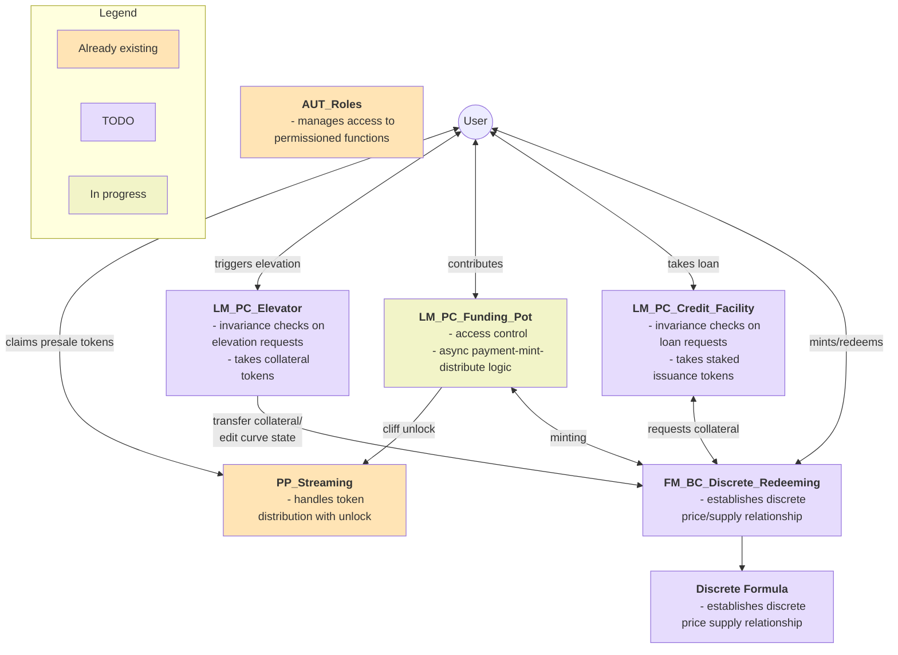
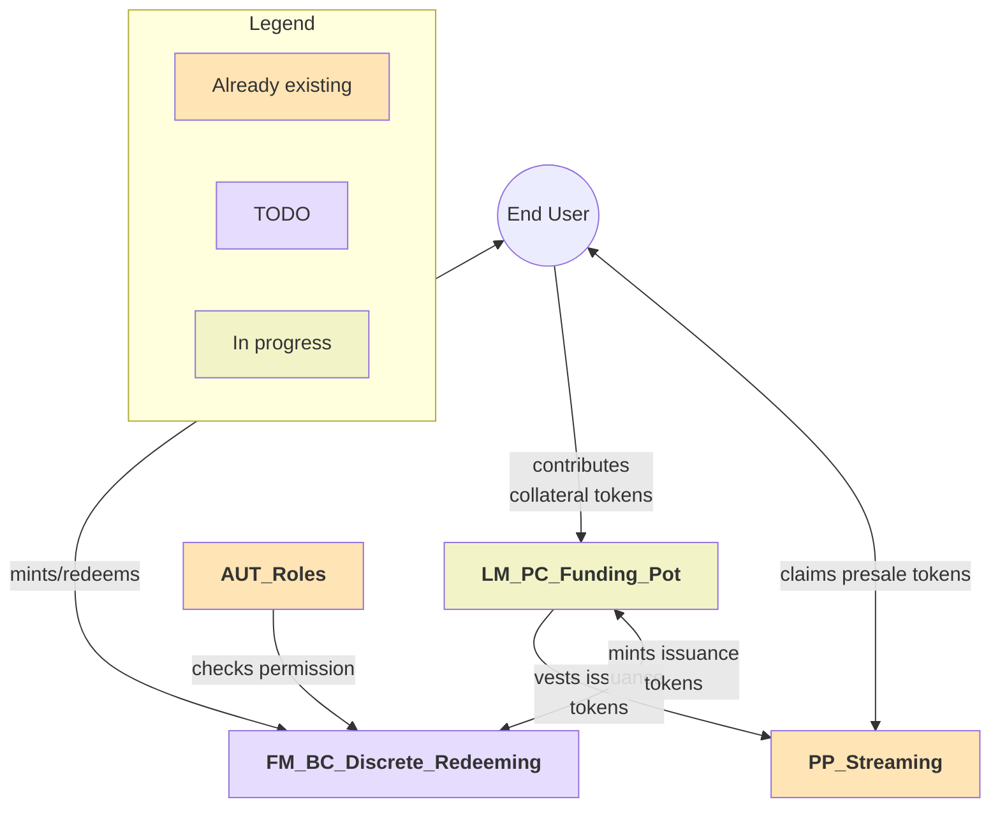
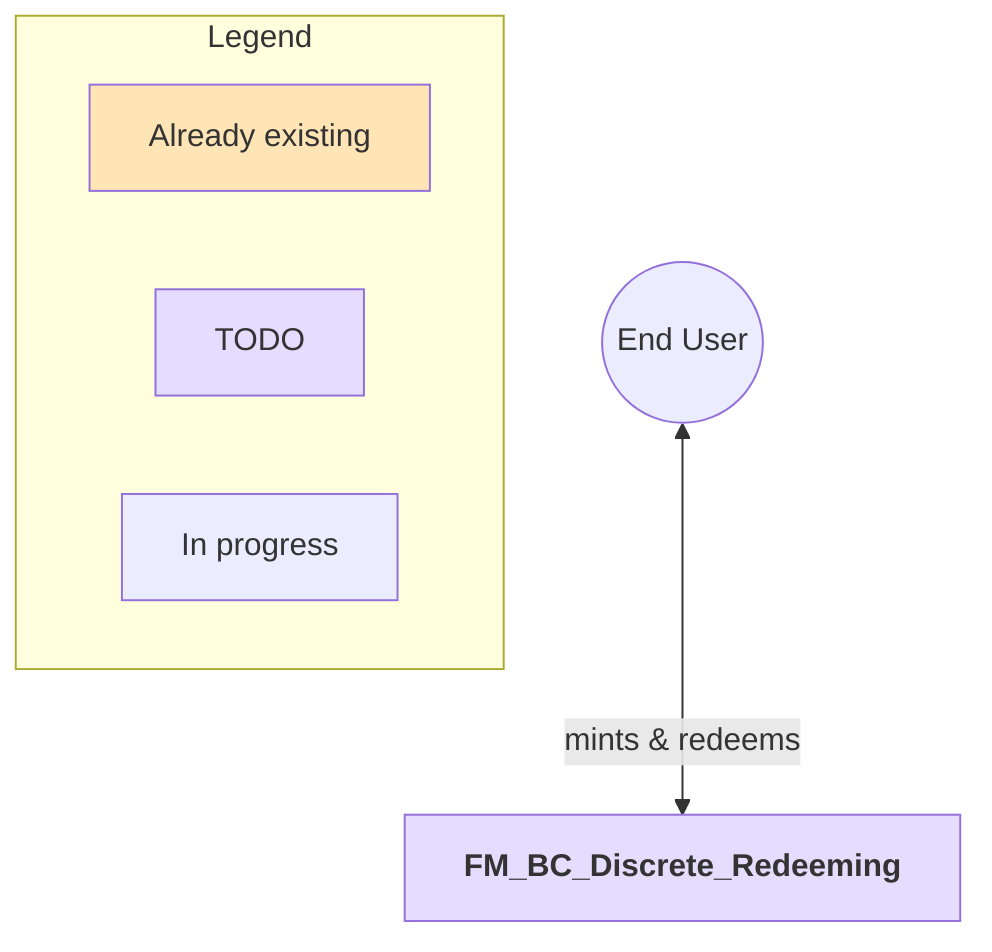
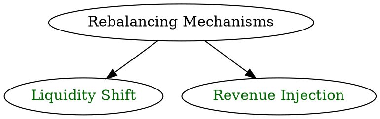
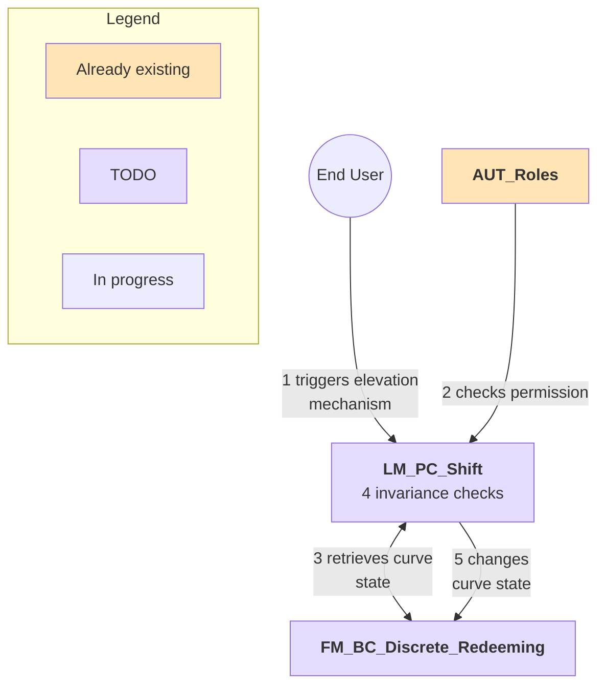
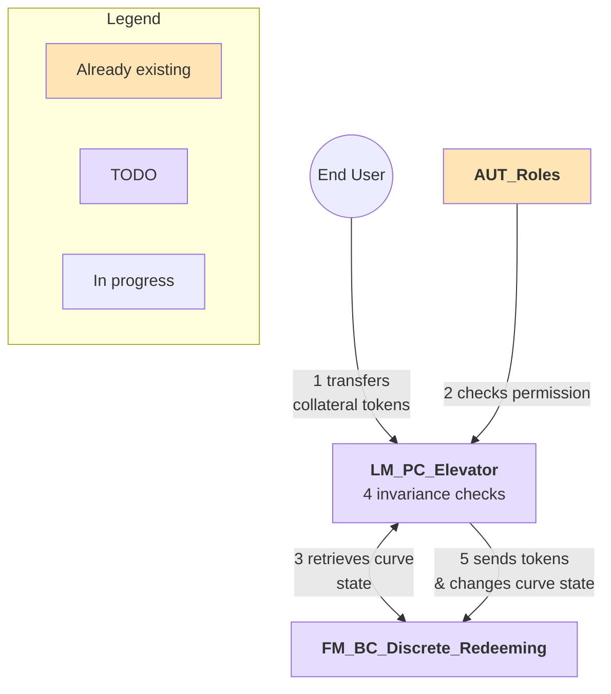

# 1. Introduction

This document provides the specifications for the House Protocol built on the Inverter stack. It describes the functionality of the new modules to be built and the interactions between them and existing modules. It is intended to be used as the source of truth reference for the development team.

It contains these sections: business context, glossary, workflow overview, functional requirements and behavioral specification.

# 2. Business Context

House Protocol is a protocol that aims to utilize crypto-economic mechanisms to support the proliferation of cultural assets. At its heart is the $HOUSE token.

In an initial, permissioned pre-sale targetting institutional investors, the token will be sold at a fixed price (denominated in a stable coin). This will be followed by the initialization of a Primary Issuance Market (PIM) where anyone can mint (and redeem) tokens from a Discrete Bonding Curve. The collected pre-sale funds together will be used to provide the backing for the first step of the step function that characterizes the bonding curve. This means the exact shape (more specifically the length of the first step) of the bonding curve can only be determined after the pre-sale has concluded.

Minting and redeeming tokens from the curve incurs a small fee. Over time this fee will be used (among other things) by the protocol to inject more collateral into the first step of the step function so that, effectively, the floor price per \$HOUSE is rising over time. The protocol comes with a baked-in credit facility that allows token holders to lock their $HOUSE to take out loans from the bonding curve's collateral. For a borrower this incurs fees, representing another source of income for the protocol.

The \$HOUSE token represents the collateral token for an ecosystem of so-called endowment tokens. Endowment tokens are ERC20 tokens that represent shares of real-world cultural assets (sports teams etc.). Endowment tokens can be launched permissionlessly by the community employing the same mechanism as for the launch of the \$HOUSE token. However, they do not come with the mechanism to raise the price floor or with a credit facility.

# 3. Glossary

| Abbreviation | Description       |
| ------------ | ----------------- |
| FM           | Funding Manager   |
| PP           | Payment Processor |
| PC           | Payment Client    |
| SC           | Smart Contract    |
| LM           | Logic Module      |
| AUT          | Authorizer        |

# 4. Workflow Overview



# 5. Functional Requirements

## 5.1. During the presale whitelisted users can buy at fixed price [DONE]

### User Story

As a whitelisted investor, I want to buy issuance tokens during the pre-sale phase to participate in the success of the project.


#### Additional Notes

**Nothing to be implemented for this requirement since both options can be done already!**

### 5.1.1. Manual Transfer [DONE]

#### Acceptance Criteria

- Whitelisted accounts send USDS to protocol multisig
- Protocol multisig mints native tokens at a fixed configurable price
- Protocol multisig send native tokens after pre-sale period is over

#### Workflow Context

TODO: module overview diagram

### 5.1.2. Funding Pot [DONE]

#### Acceptance Criteria

- during the pre-sale phase whitelisted accounts can buy tokens at a fixed configurable price
- the tokens are only issued to the investors after the pre-sale is over

#### Workflow Context



## 5.2. The issuance token follows a discrete price-supply relationship (after pre-sale)

### User Story

As a user, I want to buy and sell issuance tokens from/into the discrete bonding curve.

### Acceptance Criteria

- After the pre-sale, users can buy/redeem issuance tokens at a discrete price-supply relationship
- The mints and redemptions incur (dynamic) fees

### Workflow Context



## 5.3. The floor price rises over time

### User Story

As a buyer, I want my tokens to have a price floor that rises over time, so that my downside is capped.



### 5.3.1. Liquidity Shift

#### Acceptance Criteria

- a permissioned user can change the distribution of collateral tokens within the FM to raise the floor price of the issuance tokens
- **Note:** This is achieved by an authorized entity calling the `DBCFM.configureCurve(Segment[] memory newSegments, int256 collateralChangeAmount)` function (defined in section 6.1.4) with `collateralChangeAmount = 0` and `newSegments` designed to reallocate existing reserves.

(see illustration in next section for clarification)

#### Workflow Context



### 5.3.2. Revenue Injection

#### Acceptance Criteria

- by injecting collateral tokens into the FM it is possible to automatically raise the price floor segment(s) of the DBC
- **Note:** This is achieved by an authorized entity calling the `DBCFM.configureCurve(Segment[] memory newSegments, int256 collateralChangeAmount)` function (defined in section 6.1.4) with a positive `collateralChangeAmount` (the amount of revenue/collateral injected) and `newSegments` reflecting the desired floor price increase.

TODO: move to specs

- The floor price step increases (vertical);
- The slope of the curve remains the same (same slope);
- The spot price remains the same (vertical);
- The floor price tier equivalent width (x axis, denominated in native token supply) is the amount either increases when absorbing the next non floor price tier or remians the same;
- The total integral area for the premium liquidity could either remain the same if it does not absorb the first non floor price tier or decrease in case it absorbs the first non floor price tier;

#### Workflow Context



## 5.4 Users can borrow against their Issuance Tokens

### User Story

As an issuance token holder, I want to be able to borrow against my issuance tokens, so that I can free up liquidity while staying long on the issuance token.

### Acceptance Criteria

- Issuance token holders can borrow collateral tokens from the FM against their deposited issuance tokens where the total amount of "borrowable" collateral tokens is determined by floor price and issuance supply

TODO: move to Specs
=> Example: Alice has 100 issuance tokens, current issuance token price is $2. If the floor price is $1, then Alice has $100 of borrowing power with the $200 of issuance tokens she owns;
=>

- Borrowing incurs a fee
- the LM allows the total borrowable capital to include all the include which is within the floor price region is not exclusive to the floor price region. E.g. Floor price = $1, Spot Price = $2, Floor price supply = 100M $HOUSE, Spot price supply = 150M $HOUSE. This means up to 150M $HOUSE could be deposited to borrow for liquidity instead of being capped by the floor price supply of 100M $HOUSE. The whole region of the curve can be borrowed at the floor price.

TODO: move details to specs

### Workflow Context

TODO: module overview diagram

## 5.5 Dynamic Fees

Fees are adjusted baed on onchain KPIs and system state to optimize for systems goals and minimize risks.

### 5.5.1. Issuance & Redemption Fee

#### User Story

As House, I want to dampen and capture value from excessive issuance and redemptions spikes so that I can support a continuous price appreciation trend.

#### Acceptance Criteria

- issuance and redemption fees are reactive to the difference between floor price and current price

TODO: move stuff to specs

- The FM calculates the real through the base fee and a proportionally to the premium rate as following

$$
\begin{cases}
issuanceFee = Z,   premiumRate < A\\
issuanceFee = Z + (premiumRate-A)*m, premiumRate \ge A
\end{cases}
$$

$$
\begin{cases}
redemptionFee = Z,   premiumRate > A\\
redemptionFee = Z + (A-premiumRate)*m, premiumRate \le A
\end{cases}
$$

- The FM takes a fee on mints.

#### Workflow Context

TODO: module overview diagram

### 5.5.3. Borrowing Fee

#### User Story

As House I want to incentivize borrowing at low utilization rates as well as disincentivize and capture value from borrowing at high utilization rates to support the protocol growth.

#### Acceptance Criteria

- borrowing fees are reactive to the utilization rate

TODO: move to specs

- After the pre-sale, the LF establishes a fee for borrows
- The LF calculates the real through the base fee and a proportionally to the rate of floor liquidity as following:

$$
\begin{cases}
borrowFee = Z,   floorLiquidityRate < A\\
borrowFee = Z + (floorLiquidityRate-A)*m, floorLiquidityRate \ge A
\end{cases}
$$

Where:

$$
floorLiquidityRate = \frac{Available Floor Liquidity}{Floor Liquidity Cap}
$$

#### Workflow Context

TODO: module overview diagram

## 5.6. Issuance tokens can be bridged [IN PROGRESS]

### User Story

As a buyer, I want to receive minted tokens on a different chain than where I paid the collateral.

### Acceptance Criteria

- Buyers can choose where they receive their minted tokens (Unichain or Eth L1)

### Workflow Context

TODO: module overview diagram

## 5.7. Issuance tokens can be frozen [DONE]

### User Story

As House I want to freeze assets by sanctioned addresses, so that I can conform to AML requirements.

### Acceptance Criteria

- an admin can freeze the assets of addresses

### Workflow Context

TODO: module overview diagram

# 6. Behavioral Specifications

## 6.1. Module: District Bonding Curve (Funding Manager)

**High Level:**

- establishes discrete relationship between price of issuance token to issuance supply
  => for a given amountIn returns the amountOut for purchasing and redeeming
- The curve is composed of one or more **Segments**.
  - Each Segment is defined by an initial price, a price increase per step, a supply per step, and the number of steps.
  - Within a Segment, all **Steps** have the same length (supply delta) and same height (price delta).
  - This allows a Segment to be a flat horizontal line (if price increase per step is 0) or a uniformly sloping line.
- The number and specifics of these Segments are configurable (= segments configuration).

TODO: move to LM

- given the module's segments configuration, the module can return the associated amount of collateral for a given issuance supply


### 6.1.1. Access control

This feature enables the owner of a workflow (workflow admin) to control who can manage the DBC.

```gherkin
Feature: Access control for managing the funding pot

  Scenario Outline: Assigning/revoking funding pot admin rights
    Given the user is "<authorization_status>"
    When the user attempts to "<action>" DBC manager rights to/from an address
    Then the SC should "<expected_outcome>"

    Examples:
        | authorization_status | action | expected_outcome |
        | orchestrator admin    | assign | grant DBC manager rights to that address |
        | not orchestrator admin | assign | revert |
        | orchestrator admin    | revoke | revoke DBC manager rights to that address |
        | not orchestrator admin | revoke | revert |
```

### 6.1.2. Setup & Configuration

This section details the initial setup of the District Bonding Curve Funding Manager (DBC FM) at deployment and its subsequent configuration.

During its `init` process, the DBC FM requires:

- Its core `Segment[] memory segments` configuration to be provided, typically via `configData`. This array defines the entire initial structure of the bonding curve. The specific parameters for this initial configuration are determined and provided by the deploying entity based on the desired initial market dynamics.
- To initialize its internal `virtualIssuanceSupply` (if inheriting from `VirtualIssuanceSupplyBase_v1`). This should be set to the `totalSupply()` of the associated ERC20 issuance token contract at the time of initialization. This `virtualIssuanceSupply` then serves as the reference for all bonding curve calculations performed via `DiscreteCurveMathLib`.

At the heart of the curve configuration are the curve's sub-segments.

```gherkin
Feature: Setup and Initialization of DBC FM

  Scenario: Deploying and Initializing a DBC FM successfully
    Given an initial `Segment[] memory segments` configuration for the curve is prepared
    And other necessary parameters for the DBC FM (e.g., issuance token address, fee calculator address) are known
    And the DBC FM is designed to inherit from `VirtualIssuanceSupplyBase_v1`
    When the DBC FM is deployed and its `init` function is called with the `Segment[] memory segments` (e.g., in `configData`) and other required arguments
    Then the DBC FM should store the provided segment configuration
    And its internal `virtualIssuanceSupply` should be initialized to the `totalSupply()` of the issuance token contract
    And the DBC FM should be ready for operation

  Scenario Outline: Deploying a workflow with DBC (Generic - kept for context of orchestrator)
    Given the DBC is selected as FM for a workflow
    And the parameters that are required by inheritance are properly encoded in the configData
    When the DBC's required parameters (including Segment Configs) have <encoding_status> in the configData
    Then the SC should "<expected_outcome>"

    Examples:
        | encoding_status    | expected_outcome      |
        | ------------------ | --------------------- |
        | been encoded       | deploy the workflow   |
        | not been encoded   | revert                |
```

```gherkin
Feature: Editing

  Scenario Outline: Editing a DBC
    Given the user has <authorization_status>
    When the user attempts to edit configuration parameters
    Then the SC should "<expected_outcome>"

    Examples:
        | authorization_status | expected_outcome                               |
        | -------------------- | -----------------------------------------------|
        | DBC Manager role     | store the new config           |
        | no DBC Manager role  | revert                                         |
```

#### Parameters

| Parameter              | Description                                                                                                                                                                                                        | Mandatory (for init) | Notes                                                                     |
| ---------------------- | ------------------------------------------------------------------------------------------------------------------------------------------------------------------------------------------------------------------ | -------------------- | ------------------------------------------------------------------------- |
| Segment Configs        | Describes the curve segments. Stored as an array of structs, where each struct defines a segment with parameters like: `initialPriceOfSegment`, `priceIncreasePerStep`, `supplyPerStep`, `numberOfStepsInSegment`. | Yes                  | Initial configuration is crucial. Post-deployment edits by DBC Manager.   |
| Fee Calculator Address | Address of the active Dynamic Fee Calculator contract.                                                                                                                                                             | Yes                  | Must be set for the DBC FM to calculate dynamic fees. Updatable by admin. |

```gherkin
Feature: Updating Fee Calculator Address in DBC FM

  Scenario Outline: Setting the Fee Calculator address in DBC FM
    Given the user is "<authorization_status>"
    When the user attempts to set a new address for the Dynamic Fee Calculator in the DBC FM
    Then the SC should "<expected_outcome>"

    Examples:
        | authorization_status   | expected_outcome                                      |
        | orchestrator admin     | update the Fee Calculator address in DBC FM         |
        | not orchestrator admin | revert                                                |
```

### 6.1.3. Minting & Redeeming

At the core of this lies the implementation logic for the functions `calculatePurchaseReturn` and `calculateSalesReturn`. These functions must perform exact calculations, iterating through curve segments as necessary. Within each segment, due to the uniform step lengths and price increments, calculations can be optimized (e.g., using formulas for arithmetic series for sloped segments) rather than iterating over every individual step. There are various (edge) cases to be considered, some of which are listed.

```gherkin
Feature: Minting & Redeeming

    Scenario Outline: Minting & redeeming from the DBC
        Given the DBC has been initialized correctly
        And <action> is activateds
        When the user provides the <token> `amountIn`
        And has approved that amount to the DBC
        And provides the minAmountOut
        And submits the <action> transaction
        Then the SC <outcome>
        And fees are sent to the Fee Manager.

    Examples:
        | action| token | return_amount_status| outcome |
        | --|---- | ---------------------------|---|
        | minting| collateral token | exceeds | transfers collateral token amount into DBC and mints tokens to user |
        |redeeming| issuance token| exceeds| burns issuance token amount from user and transfers collateral token amount to user|
```

#### Noteworthy cases

This is a (noncomprehensive) list of relevant cases that should be considered. They relate to the initial issuance supply (IIS) of the curve (before swap) and to the final issuance supply (FIS) of the curve (after swap). There should be unit test cases covering all of them:

1. IIFS and FIS are within same step
2. IIFS and FIS are on adjacent steps
3. IIFS and FIS are on non-adjacent steps

### 6.1.4. Unified Curve Configuration Function

The DBC FM exposes a single, powerful function, `configureCurve(Segment[] memory newSegments, int256 collateralChangeAmount)`, to allow an authorized entity (e.g., "CurveGovernorRole" or "DBCManagerRole") to atomically modify its segment configuration and, if applicable, its virtual collateral supply, while also handling the actual collateral token transfers. This approach consolidates rebalancing logic into the FM itself. It is assumed the DBC FM inherits from `VirtualIssuanceSupplyBase_v1` and `VirtualCollateralSupplyBase_v1` and has access to the `collateralToken`'s ERC20 interface.

```gherkin
Feature: Configuring the District Bonding Curve

  Background:
    Given the DBC FM is initialized with a `collateralToken` address, `virtualIssuanceSupply`, `virtualCollateralSupply`, and `segments` configuration
    And `DiscreteCurveMathLib.calculateReserveForSupply(segments, supply)` is available for reserve calculations
    And the caller (e.g., a DAO contract or admin EOA) has the "CurveGovernorRole"

  Scenario: Successful curve reconfiguration with collateral INJECTION
    Given the caller prepares `newSegments` for the curve
    And the caller wishes to inject `collateralInjectionAmount` (a positive value)
    And the caller has approved the DBC FM to spend at least `collateralInjectionAmount` of `collateralToken`
    And `newCalculatedReserve = DiscreteCurveMathLib.calculateReserveForSupply(newSegments, currentVirtualIssuanceSupply)`
    And `expectedNewVirtualCollateral = currentVirtualCollateralSupply + collateralInjectionAmount`
    And `newCalculatedReserve` is equal to `expectedNewVirtualCollateral`
    When the caller calls `configureCurve(newSegments, collateralInjectionAmount)`
    Then the DBC FM should successfully transfer `collateralInjectionAmount` of `collateralToken` from the caller to itself
    And update its `segments` to `newSegments`
    And update its `virtualCollateralSupply` to `expectedNewVirtualCollateral`
    And emit `SegmentsConfigurationUpdated(newSegments)` and `VirtualCollateralSupplyUpdated(expectedNewVirtualCollateral)` events.

  Scenario: Successful curve reconfiguration with collateral WITHDRAWAL
    Given the caller prepares `newSegments` for the curve
    And the caller wishes to withdraw `collateralWithdrawalAmount` (expressed as a negative int256 value, e.g., -1000)
    And `newCalculatedReserve = DiscreteCurveMathLib.calculateReserveForSupply(newSegments, currentVirtualIssuanceSupply)`
    And `expectedNewVirtualCollateral = currentVirtualCollateralSupply + collateralWithdrawalAmount` (which is a subtraction)
    And `newCalculatedReserve` is equal to `expectedNewVirtualCollateral`
    And `uint256(expectedNewVirtualCollateral)` is not zero (to prevent emptying virtual collateral via this function if not desired by design)
    And the DBC FM has sufficient `collateralToken` balance to cover `abs(collateralWithdrawalAmount)`
    When the caller calls `configureCurve(newSegments, collateralWithdrawalAmount)`
    Then the DBC FM should successfully transfer `abs(collateralWithdrawalAmount)` of `collateralToken` from itself to the caller (or designated recipient)
    And update its `segments` to `newSegments`
    And update its `virtualCollateralSupply` to `expectedNewVirtualCollateral`
    And emit `SegmentsConfigurationUpdated(newSegments)` and `VirtualCollateralSupplyUpdated(expectedNewVirtualCollateral)` events.

  Scenario: Successful reserve-invariant curve REALLOCATION (no collateral change)
    Given the caller prepares `newSegments` for the curve
    And the caller sets `collateralChangeAmount` to 0
    And `newCalculatedReserve = DiscreteCurveMathLib.calculateReserveForSupply(newSegments, currentVirtualIssuanceSupply)`
    And `newCalculatedReserve` is equal to `currentVirtualCollateralSupply`
    When the caller calls `configureCurve(newSegments, 0)`
    Then the DBC FM should update its `segments` to `newSegments`
    And its `virtualCollateralSupply` should remain unchanged
    And emit `SegmentsConfigurationUpdated(newSegments)` event.

  Scenario: Failed curve reconfiguration due to INVARIANCE CHECK failure
    Given the caller prepares `newSegments` and a `collateralChangeAmount`
    And `newCalculatedReserve = DiscreteCurveMathLib.calculateReserveForSupply(newSegments, currentVirtualIssuanceSupply)`
    And `expectedNewVirtualCollateral = currentVirtualCollateralSupply + collateralChangeAmount`
    And `newCalculatedReserve` is NOT equal to `expectedNewVirtualCollateral`
    When the caller calls `configureCurve(newSegments, collateralChangeAmount)`
    Then the transaction should revert, indicating a reserve mismatch.

  Scenario: Failed curve reconfiguration due to collateral INJECTION TRANSFER failure (e.g., insufficient allowance or balance)
    Given the caller prepares `newSegments` and wishes to inject `collateralInjectionAmount`
    But the caller has NOT approved the DBC FM to spend `collateralInjectionAmount` OR the caller has insufficient balance
    And the proposed `newSegments` and `collateralInjectionAmount` would otherwise pass the invariance check
    When the caller calls `configureCurve(newSegments, collateralInjectionAmount)`
    Then the transaction should revert, typically due to the ERC20 transfer failure.

  Scenario: Failed curve reconfiguration due to collateral WITHDRAWAL TRANSFER failure (e.g., insufficient FM balance)
    Given the caller prepares `newSegments` and wishes to withdraw `collateralWithdrawalAmount` (negative value)
    And the proposed `newSegments` and `collateralWithdrawalAmount` would otherwise pass the invariance check
    But the DBC FM has insufficient `collateralToken` balance to cover `abs(collateralWithdrawalAmount)`
    When the caller calls `configureCurve(newSegments, collateralWithdrawalAmount)`
    Then the transaction should revert, due to the ERC20 transfer failure (if transfer is attempted before state update) or an explicit balance check.

  Scenario: Failed curve reconfiguration due to UNAUTHORIZED caller
    Given the caller does NOT have the "CurveGovernorRole"
    When the caller attempts to call `configureCurve(newSegments, collateralChangeAmount)`
    Then the transaction should revert due to lack of authorization.
```

## 6.2. Library: DiscreteCurveMathLib & Invariance Tools

**High Level:**

- This section describes a core utility library, `DiscreteCurveMathLib`, and its fundamental role in providing consistent, accurate mathematical operations for the District Bonding Curve.
- The library contains stateless (pure) functions for calculating purchase/sale returns and total collateral reserves based on a given segment configuration and supply.
- It is a foundational component intended for use by the District Bonding Curve Funding Manager (DBC FM), various Rebalancing Modules, and the Lending Facility to ensure precise calculations and to enable safe state transitions, particularly for invariance checks during rebalancing operations.

### 6.2.1. `DiscreteCurveMathLib`

**Purpose:**
To centralize all complex mathematical logic associated with the discrete, segment-and-step-based bonding curve structure. This approach promotes accuracy, enhances gas efficiency (e.g., by using arithmetic series sums for sloped segments rather than iterating individual steps), and improves code maintainability and auditability by isolating mathematical complexity.

**Key Functions (Illustrative Signatures):**
The library should expose pure functions that take a segment configuration (`Segment[] memory segments`) as a primary input. These functions do not rely on or modify contract state.

- `function calculatePurchaseReturn(Segment[] memory segments, uint256 collateralAmountIn, uint256 currentTotalSupply) internal pure returns (uint256 issuanceAmountOut)`
  - Calculates the amount of issuance tokens a user would receive for a given `collateralAmountIn`, based on the provided `segments` structure and the `currentTotalSupply` before the transaction.
- `function calculateSalesReturn(Segment[] memory segments, uint256 issuanceAmountIn, uint256 currentTotalSupply) internal pure returns (uint256 collateralAmountOut)`
  - Calculates the amount of collateral a user would receive for redeeming a given `issuanceAmountIn`, based on the provided `segments` and `currentTotalSupply`.
- `function calculateReserveForSupply(Segment[] memory segments, uint256 targetSupply) internal pure returns (uint256 collateralReserve)`
  - Calculates the total collateral that _should_ back the `targetSupply` of issuance tokens, according to the given `segments` configuration (i.e., effectively the area under the curve up to `targetSupply`).

**Intended Usage:**

- **District Bonding Curve Funding Manager (DBC FM):** Will utilize these library functions for its core minting/redeeming logic (passing its current segment configuration) and for providing view functions that query potential transaction outcomes or current reserve states.
- **Rebalancing Modules:** Will primarily use `calculateReserveForSupply` to perform invariance checks before proposing or applying changes to the DBC FM's segment configuration.
- **Lending Facility:** Will use `calculateReserveForSupply` (likely by calling a helper view function on the DBC FM that uses the library with the DBC FM's current state) to determine parameters like borrowable capacity based on the curve's current reserves.

### 6.2.2. Performing Invariance Checks with the Library

A critical application of `DiscreteCurveMathLib.calculateReserveForSupply` is to ensure that rebalancing operations (e.g., liquidity reallocation as described in a later section) maintain the integrity of the curve's backing collateral, unless the operation is explicitly designed to inject or remove collateral.

```gherkin
Feature: Reserve Invariance Check for Curve Reconfiguration

  Background:
    Given the system uses `DiscreteCurveMathLib.calculateReserveForSupply(segments, supply)` to determine collateral reserve for any given curve structure and supply.

  Scenario: Proposed segment configuration maintains reserve value
    Given a District Bonding Curve with `currentSegmentConfig` and `currentTotalSupply`
    And a `proposedSegmentConfig` for the curve, intended to be applied at the `currentTotalSupply`
    When `currentReserve` is calculated using `DiscreteCurveMathLib.calculateReserveForSupply(currentSegmentConfig, currentTotalSupply)`
    And `proposedReserve` is calculated using `DiscreteCurveMathLib.calculateReserveForSupply(proposedSegmentConfig, currentTotalSupply)`
    Then, for a reserve-invariant reconfiguration, `proposedReserve` must be equal to `currentReserve`.

  Scenario: Proposed segment configuration alters reserve value (and is rejected if invariance is mandated)
    Given a District Bonding Curve with `currentSegmentConfig` and `currentTotalSupply`
    And a `proposedSegmentConfig` for the curve
    And the specific rebalancing mechanism being invoked requires that the total collateral reserve remains unchanged
    When `currentReserve` is calculated using `DiscreteCurveMathLib.calculateReserveForSupply(currentSegmentConfig, currentTotalSupply)`
    And `proposedReserve` is calculated using `DiscreteCurveMathLib.calculateReserveForSupply(proposedSegmentConfig, currentTotalSupply)`
    And `proposedReserve` is not equal to `currentReserve`
    Then the proposed segment configuration change should be reverted by the rebalancing mechanism.
```


## 6.3. Module: Lending Facility (Logic Module)

**High Level:**

- Lets users lock issuance tokens in the Lending Facility (LF) in return for collateral token loans.
- The LF interacts with the District Bonding Curve Funding Manager (DBC FM) to source and return collateral tokens for these loans.
  - For loan disbursement, the LF authorizes and initiates a transfer of collateral tokens from the DBC FM to the borrower, typically by calling a function like `DBCFM.transferOrchestratorToken(borrowerAddress, loanAmount)`. The LF must have appropriate permissions to do so.
  - For loan repayment, the LF receives collateral from the borrower and transfers it back to the DBC FM.
  - **Crucially, these collateral transfers for loan operations DO NOT alter the DBC FM's `virtualCollateralSupply` or `virtualIssuanceSupply`. These virtual supplies are exclusively managed by mint/redeem operations on the bonding curve and by the `configureCurve` function.**
- The LF determines the total pool of collateral available for lending based on the DBC FM's state, specifically using the **Borrow Capacity (BC)** (defined in section 6.3.2).
  - BC is `DBCFM.virtualIssuanceSupply * P_floor` (where `P_floor` is the initial price of the DBCFM's first segment, i.e., `segments[0].initialPriceOfSegment`). This BC represents the system-wide theoretical maximum value that could be lent if all issuance tokens were valued at `P_floor` for individual borrowing power. A core assumption is that `P_floor` will only ever increase or remain the same due to curve reconfigurations; it will not decrease. This means a loan's collateralization (based on `P_floor` at origination) is not at risk from `P_floor` changes.
  - The LF applies a configurable **Borrowable Quota (BQ)** (a percentage) to BC to establish the `MaxSystemLoans = BC * BQ`. This is the policy limit for total outstanding loans.
  - The LF manages loan requests against this `MaxSystemLoans` limit and individual user borrowing limits (which are also based on `UserLockedTokens * P_floor` at the time of loan origination).
  - Loan disbursements rely on the DBC FM having sufficient _actual_ (liquid) collateral tokens at the moment of transfer; a transfer request will fail if the DBC FM's actual balance is insufficient.
- Getting back the locked issuance tokens requires the user to pay back the loan in full.

### 6.3.1. Access Control

This feature enables the owner of a workflow (workflow admin) to control who can configure the lending facility.

```gherkin
Feature: Access control for managing lending facility

  Scenario Outline: Assigning/revoking lending facility admin rights
    Given the user is "<authorization_status>"
    When the user attempts to "<action>" lending facility manager rights to/from an address
    Then the SC should "<expected_outcome>"

    Examples:
        | authorization_status | action | expected_outcome |
        | orchestrator admin    | assign | grant lending facility manager rights to that address |
        | not orchestrator admin | assign | revert |
        | orchestrator admin    | revoke | revoke lending facility manager rights to that address |
        | not orchestrator admin | revoke | revert |
```

### 6.3.2. Configuring the borrow parameters

While the total borrowable capacity is determined by the state of the DBC (supply and segments config, calculated via `DiscreteCurveMathLib`), this is about configuring how much of that total borrowable amount can actually be borrowed in relative terms and about setting boundaries for users.

Glossary:

- Borrow Capacity (BC): The system-wide theoretical maximum amount of collateral that can be lent out. It is calculated as: `virtualIssuanceSupply * P_floor`, where `P_floor` is the price defined by the initial price of the first segment (e.g., `segments[0].initialPriceOfSegment`) of the DBC FM's current configuration.
- Borrowable Quota (BQ): the percentage relative to BC that determines how much can actually be borrowed; configurable
- Currently Borrowed Amount (CBA): the (absolute) total amount of outstanding loans
- Current Borrow Quota (CBQ): the percentage of the BC that is currently borrowed

```gherkin
Background:
    Given the user holds lending facility manager role

Feature: Editing the Borrowable Quota
    Scenario: New BQ is higher than CBQ
        Given the new target BQ is higher than the CBQ
        When the user submits the new target BQ
        Then the SC stores the new BQ

    Scenario: New BQ is lower than CBQ
        Given the new target BQ is lower than the CBQ
        When the user submits the new target BQ
        Then the SC reverts

Feature: Editing the Individual Borrow Limit
    Scenario:
        When the user changes the individual borrow limit
        Then the SC stores the new individual borrow limit

Feature: Editing Borrowing Fee Parameters
    Background:
        Given the user holds lending facility manager role

    Scenario Outline: Editing LF borrowing fee parameter <parameter_name>
        When the user submits a new value for LF borrowing fee parameter <parameter_name>
        Then the SC should store the new <parameter_name> value for the LF
        And an event should be emitted logging the change

    Examples:
        | parameter_name         |
        | BorrowingFeeBase       | # Z_borrow
        | BorrowingFeeThreshold  | # A_borrow
        | BorrowingFeeMultiplier | # m_borrow

#### Parameter overview

| Parameter                | Explanation                                                                    | Notes                                                                    |
| ------------------------ | ------------------------------------------------------------------------------ | ------------------------------------------------------------------------ |
| Borrowable Quota         | Percentage of BC that can be borrowed out to users                             |                                                                          |
| Individual Borrow Limit  | Absolute borrow limit per user                                                 | Changes to this only affect new loan requests                            |
| BorrowingFeeBase         | Base fee component (Z_borrow) for the dynamic borrowing fee (see 5.5.3)        | Configurable by LF Manager. Affects new loan requests.                 |
| BorrowingFeeThreshold    | `floorLiquidityRate` threshold (A_borrow) for dynamic fee (see 5.5.3)        | Configurable by LF Manager. Affects new loan requests.                 |
| BorrowingFeeMultiplier   | Multiplier (m_borrow) for dynamic fee component (see 5.5.3)                    | Configurable by LF Manager. Affects new loan requests.                 |
```

### 6.3.3. Borrowing / Repaying

```gherkin
Feature: Borrowing collateral tokens against issuance tokens

    Scenario: Valid loan request with dynamic upfront borrowing fee deduction
        Given the user holds issuance tokens and requests a `requestedLoanAmount`
        And the LF is configured with `BorrowingFeeBase`, `BorrowingFeeThreshold`, and `BorrowingFeeMultiplier`
        And the LF can determine the current `floorLiquidityRate` (e.g., `(BC * BQ - CBA) / (BC * BQ)`)
        And the BQ is not yet reached for the `requestedLoanAmount` (i.e., `CBA + requestedLoanAmount <= BC * BQ`)
        And the `requestedLoanAmount` does not exceed the Individual Borrow Limit
        When the user attempts to take out the loan
        Then the SC locks the user's issuance tokens
        And the LF calculates the `dynamicBorrowingFeeRate` based on `floorLiquidityRate` and its Z, A, m parameters (as per formula in 5.5.3)
        And the LF calculates `dynamicBorrowingFee = requestedLoanAmount * dynamicBorrowingFeeRate`
        And the LF calculates `netAmountToUser = requestedLoanAmount - dynamicBorrowingFee`
        And the LF instructs the DBC FM to transfer `dynamicBorrowingFee` to the Fee Manager
        And the LF instructs the DBC FM to transfer `netAmountToUser` to the user
        And the user's outstanding loan principal is recorded as `requestedLoanAmount`.

    Scenario: Loan request breaching limits is reverted
        Given the user holds issuance tokens
        And the BQ is not yet reached // This condition might need rephrasing based on how limits are checked against requested vs. net amounts
        And issuing the new loan breaches Borrowable Quota or Individual Borrow Limit // This check should be against requestedLoanAmount
        When the user attempts to take out a loan against their issuance tokens
        Then the SC reverts

Feature: Repaying
    Scenario: Repaying a loan
        Given the user has an outstanding loan with `loanPrincipalOwed` (which was the original `requestedLoanAmount`)
        When the user repays `loanPrincipalOwed` of collateral tokens to the Lending Facility
        Then the LF receives the collateral and transfers it back to the DBC FM
        And the SC unlocks and transfers the user's locked issuance tokens back to the user.
```

#### Additional Info

The system-wide Borrow Capacity (BC) is determined by multiplying the DBC FM's current `virtualIssuanceSupply` by the floor price (`P_floor`), which is the initial price of the first segment in the DBC FM's active segment configuration (i.e., `segments[0].initialPriceOfSegment`). An individual user's borrowing power for a specific loan is then `UserLockedIssuanceTokens * P_floor` (calculated at the time of loan origination), subject to the overall Borrowable Quota and Individual Borrow Limit. The system assumes `P_floor` will only increase or remain static over time, thus protecting existing loans from decreased collateral value due to `P_floor` adjustments. A loan liquidation mechanism is not specified as undercollateralization due to `P_floor` changes is not expected.


## 6.4. Module: Dynamic Fee Calculator

**High Level:**

- Calculates dynamic issuance and redemption fees for the District Bonding Curve Funding Manager (DBC FM).
- Designed as a separate, exchangeable module to allow for future updates to fee logic without altering the DBC FM.
- The DBC FM will make an external call to this module during minting and redeeming operations to determine the applicable fee.

### 6.4.1. Fee Calculation Logic

- The core logic implements the dynamic fee formulas specified in section [5.5.1. Issuance & Redemption Fee](#551-issuance--redemption-fee).
- It takes inputs such as the `premiumRate` (or data to calculate it, like current price and floor price from the DBC FM), the type of operation (mint/redeem), and potentially the transaction amount.
- It returns the calculated fee amount to the DBC FM.

### 6.4.2. Access Control

This feature enables an administrator (e.g., orchestrator admin or a specifically assigned "Fee Manager Admin") to configure the parameters of the fee calculation.

```gherkin
Feature: Access control for managing Fee Calculator parameters

  Scenario Outline: Assigning/revoking Fee Calculator admin rights
    Given the user is "<authorization_status>"
    When the user attempts to "<action>" Fee Calculator admin rights to/from an address
    Then the SC should "<expected_outcome>"

    Examples:
        | authorization_status      | action | expected_outcome                                  |
        | orchestrator admin        | assign | grant Fee Calculator admin rights to that address |
        | not orchestrator admin    | assign | revert                                            |
        | orchestrator admin        | revoke | revoke Fee Calculator admin rights from that address|
        | not orchestrator admin    | revoke | revert                                            |
```

### 6.4.3. Configuration Parameters

The parameters for the fee calculation formulas are configurable by an authorized admin.

| Parameter | Description                                                                   | Notes                                 |
| --------- | ----------------------------------------------------------------------------- | ------------------------------------- |
| `Z`       | Base fee component (as per formulas in 5.5.1)                                 | Configurable by Fee Calculator Admin. |
| `A`       | `premiumRate` threshold for dynamic fee adjustment (as per formulas in 5.5.1) | Configurable by Fee Calculator Admin. |
| `m`       | Multiplier for dynamic fee component (as per formulas in 5.5.1)               | Configurable by Fee Calculator Admin. |

#### Gherkin Scenarios for Configuration

```gherkin
Feature: Editing Fee Calculator Parameters
    Background:
        Given the user holds the Fee Calculator admin role

    Scenario Outline: Editing parameter <parameter_name>
        When the user submits a new value for <parameter_name>
        Then the SC should store the new <parameter_name> value
        And an event should be emitted logging the change

    Examples:
        | parameter_name |
        | Z              |
        | A              |
        | m              |
```

### 6.4.4. Interaction with DBC Funding Manager

- The District Bonding Curve Funding Manager (DBC FM) will hold an address to the currently active Dynamic Fee Calculator contract.
- This address should be updatable by an authorized admin (e.g., orchestrator admin) to allow for new fee models to be deployed and used.

```gherkin
Feature: DBC FM using Fee Calculator

    Scenario: Minting operation with dynamic fee
        Given the DBC FM is configured with a valid Dynamic Fee Calculator address
        When a user initiates a mint operation on the DBC FM
        Then the DBC FM calls the Dynamic Fee Calculator with relevant context (e.g., premiumRate, amount)
        And the Dynamic Fee Calculator returns the calculated fee
        And the DBC FM uses this fee to adjust the minting outcome and direct the fee to the Fee Manager

    Scenario: Redeeming operation with dynamic fee
        Given the DBC FM is configured with a valid Dynamic Fee Calculator address
        When a user initiates a redeem operation on the DBC FM
        Then the DBC FM calls the Dynamic Fee Calculator with relevant context (e.g., premiumRate, amount)
        And the Dynamic Fee Calculator returns the calculated fee
        And the DBC FM uses this fee to adjust the redeeming outcome and direct the fee to the Fee Manager
```
