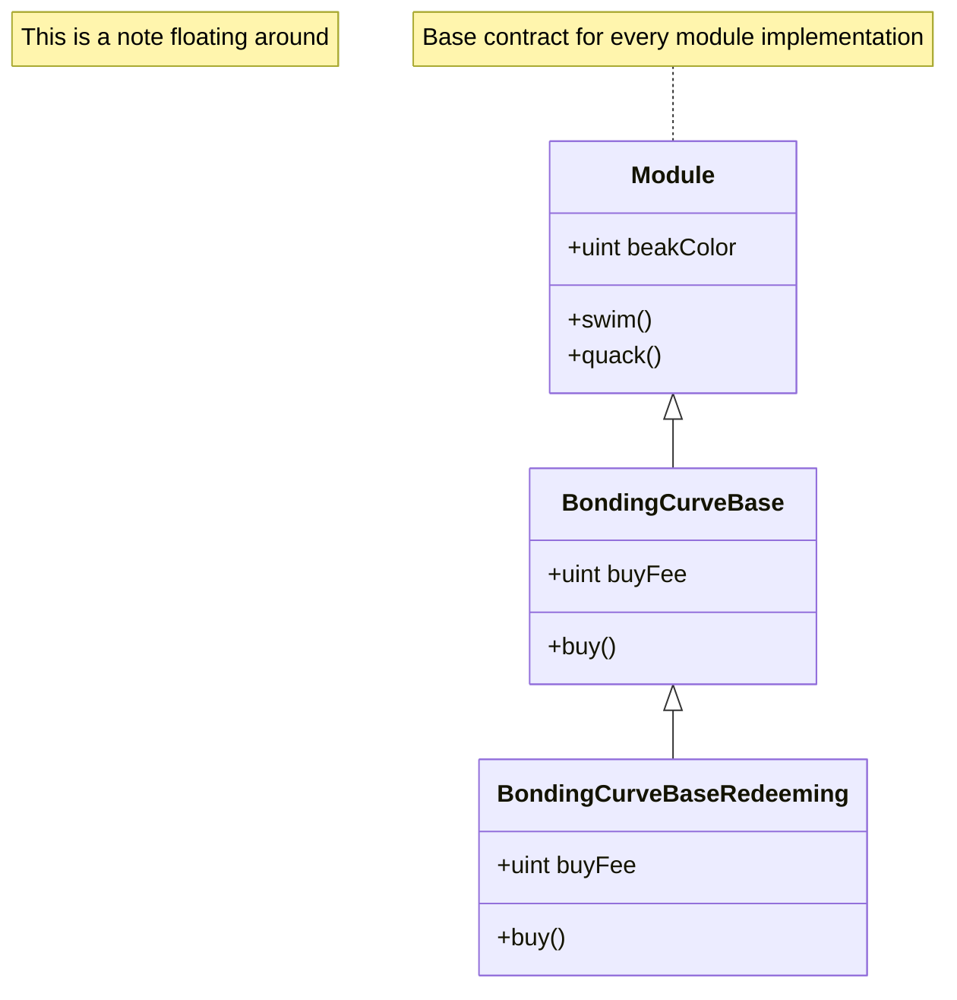
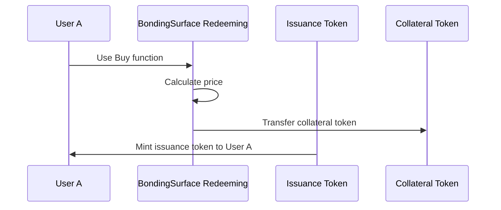

# Title of Contract

## UML Class Diagramm

Using Mermaid to create a UML class diagramm.

## Definitions

To understand the functionalities of the following contract it is important to understand the following definitions.

**Example: Issuance Token**: Issuance tokens are tokens that are distributed from the bonding surface contract.

**Role Management**: The underlying inverter workflow structures have the ability to add and remove roles. These roles are used to manage the access to specific functions of inverter contracts. A role can be assigned to a specific address or contract address. A function that is restricted to a role can only be called by the address that has been assigned the role.
Each workflow has to determine a Workflow Admin during its deployment. This Workflow Admin has the ability to add and remove, as well as assign roles to addresses. The restriction to the Workflow admin is a standard restriction that is used throughout the inverter workflow contracts.

## Purpose of this contract

## Inheritance

Because this contract is based on the \<Example> and \<Example> contracts, it inherits their functionalities. These functionalities are described in the following sections.

**Example: Buy**: The buy function allows users to buy issuance tokens from the bonding surface contract by providing collateral tokens. The collateral tokens are specified in the token() field of the bonding surface contract.

**Example: Project Fee Collection**: The bonding curve contract is able to collect project fees in collateral tokens from users that use the buy and sell functions. The fees are taken as a percentage of the incoming/outgoing collateral tokens and are stored in the contract itself for later withdrawal. The workflow admin can set the fees via the setBuyFee and setSellFee functions respectively. To withdraw the fees the withdrawProjectCollateralFee() function can be used.

## Central Functions

**Example**: The key point that distinguishes this contract from the base contracts is ...

**Example: Buy**: The buy function allows users to buy issuance tokens from the bonding surface contract by providing collateral tokens.

## User Stories

### Example: Buy

## Setup

For the contract setup the following contracts and parameters are needed:

### Before Workflow Deployment

Some steps have to be taken before the contract is deployed.

**Example Issuance Token**: The ERC20 contract of the token that the BondingCurve contract will distribute/issue.
This contract needs to be deployed before the bonding surface workflow is deployed, as the reference to the contract address is needed in the workflow deployment.

### During Workflow Deployment

These steps are needed during the workflow deployment.

**Example Deployment Parameters**: The following parameters need to be put in during the workflow deployment:

- **issuanceToken address**: What is the address of the issuance token?
- **acceptedToken (collateral Token) address**: What is the address of the token that is accepted as collateral by the BondingCurve contract?
- **capitalRequired uint**: What is the capital that is needed to operate the protocol according to market size and conditions?

### After Workflow Deployment

Some steps have to be taken after the workflow is deployed.

**Example Issuance Token**: For the setup to work the Issuance Token needs to enable and expose the Bonding Curve contract to use the mint and burn functionalities after the workflow deployment is finished.
