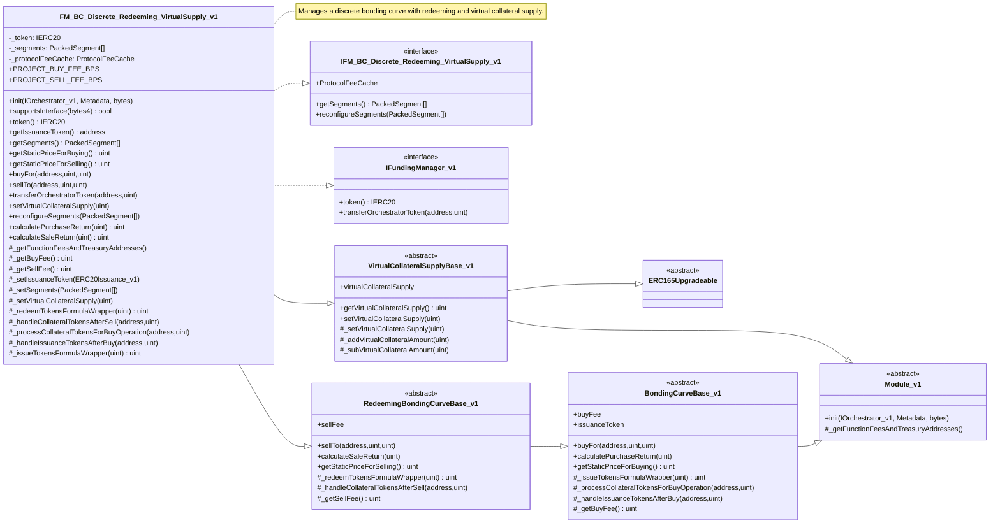
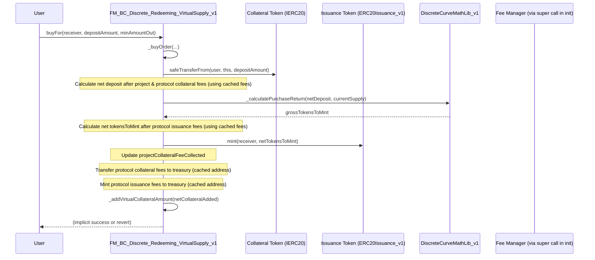
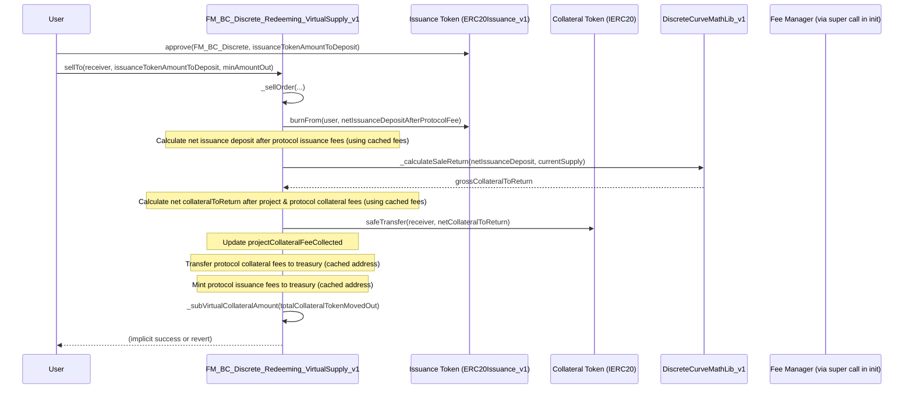
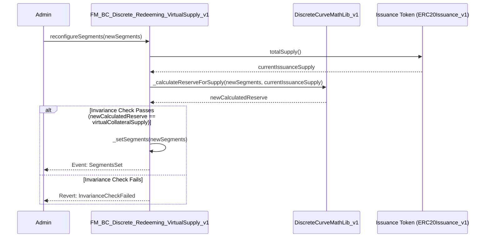

# FM_BC_Discrete_Redeeming_VirtualSupply_v1

## Purpose of Contract

_This contract serves as a Funding Manager (FM) module for the Inverter Protocol. It implements a discrete bonding curve with redeeming capabilities, allowing users to buy (mint) and sell (redeem) an issuance token against a collateral token. The curve's price points are defined by an array of packed segments. A key feature is its management of a virtual collateral supply, which is used in conjunction with the actual issuance token supply for price calculations and curve operations. It also incorporates a fee mechanism, including fixed project fees and cached protocol fees._

## Glossary

To understand the functionalities of the following contract, it is important to be familiar with the following definitions.

| Definition                   | Explanation                                                                                                                                                                                     |
| ---------------------------- | ----------------------------------------------------------------------------------------------------------------------------------------------------------------------------------------------- |
| FM                           | Funding Manager type module, responsible for managing the issuance and redemption of tokens, and holding collateral.                                                                            |
| Issuance Token               | The ERC20 token minted by this FM when users deposit collateral (e.g., $HOUSE token).                                                                                                           |
| Collateral Token             | The ERC20 token users deposit to buy issuance tokens, or receive when selling issuance tokens (e.g., a stablecoin).                                                                             |
| PackedSegment                | A struct that efficiently stores the parameters of a single segment of the discrete bonding curve (initial price, price increase per step, supply per step, number of steps).                   |
| Discrete Bonding Curve (DBC) | A bonding curve where the price changes in discrete steps rather than continuously.                                                                                                             |
| Virtual Collateral Supply    | A state variable representing the total collateral that _should_ be backing the issuance tokens according to the curve's state, used for calculations. It's updated during buy/sell operations. |
| Protocol Fee                 | Fees defined by the broader protocol/orchestrator, managed by a `FeeManager` contract. These are cached by this FM during initialization.                                                       |
| Project Fee                  | Fees specific to this FM instance, currently hardcoded as constants for buy and sell operations.                                                                                                |
| Orchestrator                 | The central contract that manages and coordinates different modules within a workflow.                                                                                                          |

## Implementation Design Decision

_The purpose of this section is to inform the user about important design decisions made during the development process. The focus should be on why a certain decision was made and how it has been implemented._

- **Discrete Bonding Curve Model:** The contract employs a discrete bonding curve, where prices are defined by a series of segments, and within each segment, by discrete steps. This provides predictable price points and allows for flexible curve shapes.
- **`PackedSegment` for Efficiency:** Curve segments are defined using `PackedSegment` structs, which utilize bit-packing (via `DiscreteCurveMathLib_v1` which internally uses `PackedSegmentLib.sol` principles) to store segment parameters gas-efficiently on-chain.
- **`DiscreteCurveMathLib_v1` for Calculations:** All core mathematical operations for the bonding curve (calculating purchase/sale returns, finding positions on the curve, validating segments) are delegated to the `DiscreteCurveMathLib_v1` library. This separation enhances modularity, testability, and auditability.
- **Virtual Collateral Supply:** The contract maintains a `virtualCollateralSupply`. This value is updated with the net collateral added or removed during buy/sell operations. It, along with the `issuanceToken.totalSupply()`, serves as a crucial input for the `DiscreteCurveMathLib_v1` to determine current price points and calculate transaction outcomes. This decouples the mathematical model slightly from the instantaneous physical balance for certain calculations, especially relevant for `getStaticPriceForBuying`.
- **Protocol Fee Caching:** To optimize gas usage and reduce external calls, protocol fees (both collateral and issuance side, for buy and sell operations) and their respective treasury addresses are fetched from the `FeeManager` contract once during initialization (`__FM_BC_Discrete_Redeeming_VirtualSupply_v1_Init`) and stored in the `_protocolFeeCache` struct. The overridden `_getFunctionFeesAndTreasuryAddresses` function then serves these cached values for internal calls during `calculatePurchaseReturn`, `calculateSaleReturn`, `_buyOrder`, and `_sellOrder`.
- **Fixed Project Fees:** Project-specific fees for buy and sell operations are currently implemented as hardcoded constants (`PROJECT_BUY_FEE_BPS`, `PROJECT_SELL_FEE_BPS`) and are set during initialization. These are retrieved via the overridden `_getBuyFee()` and `_getSellFee()` internal functions.
- **Modular Inheritance:** The contract inherits from several base contracts (`VirtualCollateralSupplyBase_v1`, `RedeemingBondingCurveBase_v1`, `Module_v1`) to reuse common functionalities and adhere to the Inverter module framework.

## Inheritance

### UML Class Diagramm



### Base Contracts

The contract `FM_BC_Discrete_Redeeming_VirtualSupply_v1` inherits from:

- `IFM_BC_Discrete_Redeeming_VirtualSupply_v1`: Interface specific to this contract.
- `IFundingManager_v1`: Standard interface for Funding Manager modules. ([Link to IFundingManager_v1 docs - Placeholder])
- `VirtualCollateralSupplyBase_v1`: Abstract contract providing logic for managing a virtual collateral supply. ([Link to VirtualCollateralSupplyBase_v1 docs - Placeholder])
- `RedeemingBondingCurveBase_v1`: Abstract contract providing base functionalities for a bonding curve that supports redeeming. This itself inherits from `BondingCurveBase_v1` and `Module_v1`. ([Link to RedeemingBondingCurveBase_v1 docs - Placeholder])

Functions that have been overridden to adapt functionalities are outlined below.

### Key Changes to Base Contract

_The purpose of this section is to highlight which functions of the base contract have been overridden and why._

- `supportsInterface(bytes4 interfaceId)`: Overridden from `RedeemingBondingCurveBase_v1` and `VirtualCollateralSupplyBase_v1` to include `type(IFM_BC_Discrete_Redeeming_VirtualSupply_v1).interfaceId` and `type(IFundingManager_v1).interfaceId` in the check, in addition to calling `super.supportsInterface(interfaceId)`.
- `init(IOrchestrator_v1 orchestrator_, Metadata memory metadata_, bytes memory configData_)`: Overridden from `Module_v1` to decode `configData_` (issuance token address, collateral token address, initial segments) and call `__FM_BC_Discrete_Redeeming_VirtualSupply_v1_Init` for specific initialization.
- `__FM_BC_Discrete_Redeeming_VirtualSupply_v1_Init(...)`: Internal initializer that sets up issuance token, collateral token, initial segments, project fees, and caches protocol fees.
- `token()`: Implements `IFundingManager_v1` to return the collateral token (`_token`).
- `getIssuanceToken()`: Overridden from `BondingCurveBase_v1` and `IBondingCurveBase_v1` to return the address of the `issuanceToken`.
- `getStaticPriceForBuying()`: Overridden from `BondingCurveBase_v1`, `IBondingCurveBase_v1`, and `IFM_BC_Discrete_Redeeming_VirtualSupply_v1`. Implemented to find the price on the curve for `virtualCollateralSupply + 1` using `_segments._findPositionForSupply`.
- `getStaticPriceForSelling()`: Overridden from `RedeemingBondingCurveBase_v1` and `IFM_BC_Discrete_Redeeming_VirtualSupply_v1`. Implemented to find the price on the curve for `issuanceToken.totalSupply()` using `_segments._findPositionForSupply`.
- `buyFor(address _receiver, uint _depositAmount, uint _minAmountOut)`: Overridden from `BondingCurveBase_v1` and `IBondingCurveBase_v1`. Calls `_buyOrder` and then updates the `virtualCollateralSupply` by adding the net collateral received.
- `sellTo(address _receiver, uint _depositAmount, uint _minAmountOut)`: Overridden from `RedeemingBondingCurveBase_v1`. Calls `_sellOrder` and then updates the `virtualCollateralSupply` by subtracting the total collateral paid out.
- `setVirtualCollateralSupply(uint virtualSupply_)`: Overridden from `VirtualCollateralSupplyBase_v1` and `IFM_BC_Discrete_Redeeming_VirtualSupply_v1` to be `onlyOrchestratorAdmin` and calls `_setVirtualCollateralSupply`.
- `_setVirtualCollateralSupply(uint virtualSupply_)`: Overridden from `VirtualCollateralSupplyBase_v1` to call `super._setVirtualCollateralSupply`.
- `calculatePurchaseReturn(uint _depositAmount)`: Overridden from `BondingCurveBase_v1` and `IBondingCurveBase_v1`. Calculates the net mint amount after deducting cached protocol fees (collateral and issuance side) and project buy fees from collateral. Uses `_issueTokensFormulaWrapper` for the gross calculation.
- `calculateSaleReturn(uint _depositAmount)`: Overridden from `RedeemingBondingCurveBase_v1`. Calculates the net redeem amount after deducting cached protocol fees (issuance and collateral side) and project sell fees from collateral. Uses `_redeemTokensFormulaWrapper` for the gross calculation.
- `_getFunctionFeesAndTreasuryAddresses(bytes4 functionSelector_)`: Overridden from `Module_v1`. Returns cached protocol fees and treasury addresses from `_protocolFeeCache` for buy/sell related function selectors, otherwise defers to `super`.
- `_getBuyFee()`: Overridden from `BondingCurveBase_v1` to return the constant `PROJECT_BUY_FEE_BPS`.
- `_getSellFee()`: Overridden from `RedeemingBondingCurveBase_v1` to return the constant `PROJECT_SELL_FEE_BPS`.
- `_issueTokensFormulaWrapper(uint _depositAmount)`: Implements the abstract function from `BondingCurveBase_v1`. Uses `_segments._calculatePurchaseReturn` from `DiscreteCurveMathLib_v1`.
- `_redeemTokensFormulaWrapper(uint _depositAmount)`: Implements the abstract function from `RedeemingBondingCurveBase_v1`. Uses `_segments._calculateSaleReturn` from `DiscreteCurveMathLib_v1`.
- `_processCollateralTokensForBuyOperation(address _provider, uint _amount)`: Implements the abstract function from `BondingCurveBase_v1`. Transfers collateral from `_provider` to the contract.
- `_handleIssuanceTokensAfterBuy(address _receiver, uint _amount)`: Implements the abstract function from `BondingCurveBase_v1`. Mints issuance tokens to `_receiver`.
- `_handleCollateralTokensAfterSell(address _receiver, uint _collateralTokenAmount)`: Implements the abstract function from `RedeemingBondingCurveBase_v1`. Transfers collateral to `_receiver`.

## User Interactions

_The purpose of this section is to highlight common user interaction flows, specifically those that involve a multi-step process. Please note that only the user interactions defined in this contract should be listed. Functionalities inherited from base contracts should be referenced accordingly._

### Function: `buyFor` (Buy Issuance Tokens)

To execute a buy operation (mint issuance tokens by depositing collateral):
**Precondition**

- Buying must be enabled (inherited from `BondingCurveBase_v1`).
- The `_receiver` address must be valid (not address(0)).
- The caller (or `msg.sender` if they are the provider) must have sufficient collateral tokens.
- The caller must have approved the FM contract to spend their collateral tokens.

1.  **Get `minAmountOut` (Recommended):**
    To protect against slippage, the minimum amount of issuance tokens expected can be pre-computed.
    ```solidity
    // Assuming 'fm' is an instance of FM_BC_Discrete_Redeeming_VirtualSupply_v1
    // and 'collateralTokenAmountToDeposit' is the amount of collateral tokens the user wants to spend.
    uint collateralTokenAmountToDeposit = 1000 * 10**18; // Example: 1000 collateral tokens
    uint minIssuanceTokensOut = fm.calculatePurchaseReturn(collateralTokenAmountToDeposit);
    // Apply a slippage tolerance if desired, e.g., minIssuanceTokensOut = minIssuanceTokensOut * 99 / 100; (1% slippage)
    ```
2.  **Call `buyFor` Function:**
    `solidity
// User wants to buy for themselves
address receiver = msg.sender;
fm.buyFor(receiver, collateralTokenAmountToDeposit, minIssuanceTokensOut);
`
    **Sequence Diagram**



### Function: `sellTo` (Sell Issuance Tokens)

To execute a sell operation (redeem issuance tokens for collateral):
**Precondition**

- Selling must be enabled (inherited from `RedeemingBondingCurveBase_v1`).
- The `_receiver` address must be valid.
- The caller (or `msg.sender` if they are the provider) must have sufficient issuance tokens.
- The caller must have approved the FM contract to spend their issuance tokens.

1.  **Get `minAmountOut` (Recommended):**
    To protect against slippage, the minimum amount of collateral tokens expected can be pre-computed.
    ```solidity
    // Assuming 'fm' is an instance of FM_BC_Discrete_Redeeming_VirtualSupply_v1
    // and 'issuanceTokenAmountToDeposit' is the amount of issuance tokens the user wants to sell.
    uint issuanceTokenAmountToDeposit = 500 * 10**18; // Example: 500 issuance tokens
    uint minCollateralTokensOut = fm.calculateSaleReturn(issuanceTokenAmountToDeposit);
    // Apply a slippage tolerance if desired
    ```
2.  **Call `sellTo` Function:**
    `solidity
// User wants to sell and receive collateral themselves
address receiver = msg.sender;
fm.sellTo(receiver, issuanceTokenAmountToDeposit, minCollateralTokensOut);
`
    **Sequence Diagram**



### Function: `reconfigureSegments` (Admin Interaction)

Allows an `orchestratorAdmin` to change the bonding curve's segment configuration.
**Precondition**

- Caller must have the `orchestratorAdmin` role (enforced by `onlyOrchestratorAdmin` modifier).

**Steps**

1.  The admin prepares a new array of `PackedSegment[] memory newSegments_`.
2.  The admin calls `fm.reconfigureSegments(newSegments_)`.

**Important Note:** The function includes an invariance check: `newSegments_._calculateReserveForSupply(issuanceToken.totalSupply())` must equal `virtualCollateralSupply`. If not, the transaction reverts. This ensures the new curve configuration is consistent with the current backing.

**Sequence Diagram**



## Deployment

### Preconditions

The following preconditions must be met before deployment:

- A deployed Orchestrator contract (`IOrchestrator_v1`).
- A deployed Issuance Token contract that implements `ERC20Issuance_v1` (to allow the FM to mint tokens).
- A deployed Collateral Token contract (`IERC20Metadata`).
- A deployed Fee Manager contract, configured with appropriate fees and treasury for this FM's orchestrator and module address.

### Deployment Parameters

The `init` function is called by the Orchestrator during module registration. The `configData_` bytes argument must be ABI encoded with the following parameters:

```solidity
(
    address issuanceTokenAddress, // Address of the ERC20Issuance_v1 token
    address collateralTokenAddress, // Address of the IERC20Metadata collateral token
    PackedSegment[] memory initialSegments // The initial array of packed segments for the curve
)
```

Example (conceptual encoding):
`abi.encode(0xIssuanceToken, 0xCollateralToken, initialSegmentsArray)`

The list of deployment parameters can also be found in the _Technical Reference_ section of the documentation under the `init()` function ([link - Placeholder for NatSpec link]).

### Deployment

Deployment should be done using one of the methods provided below:

- **Manual deployment:** Through Inverter Network's [Control Room application](https://beta.controlroom.inverter.network/).
- **SDK deployment:** Through Inverter Network's [TypeScript SDK](https://docs.inverter.network/sdk/typescript-sdk/guides/deploy-a-workflow) or [React SDK](https://docs.inverter.network/sdk/react-sdk/guides/deploy-a-workflow).

### Setup Steps

- The primary setup occurs during the `init` call, which configures tokens, segments, and fees.
- After deployment, the `orchestratorAdmin` might need to:
  - Call `setVirtualCollateralSupply(initialSupply)` if the curve needs an initial virtual collateral amount not established through initial buys.
  - Configure other related modules or permissions in the Orchestrator if necessary.

After deployment, the mandatory and optional setup steps can be found in the contract NatSpec ([link - Placeholder for NatSpec link]).
