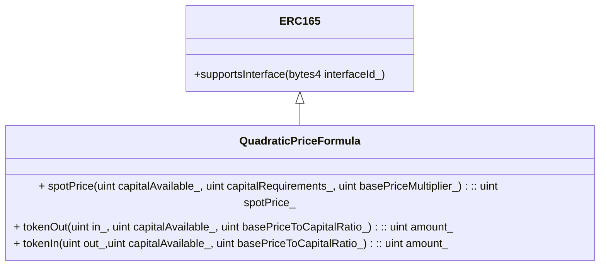
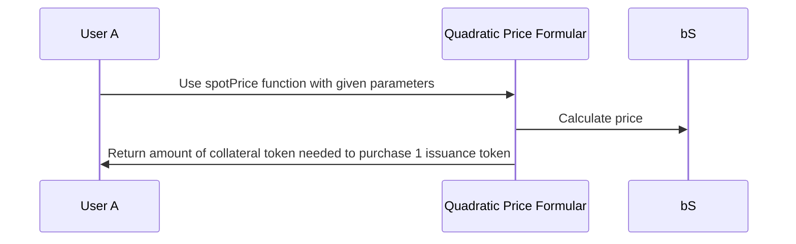
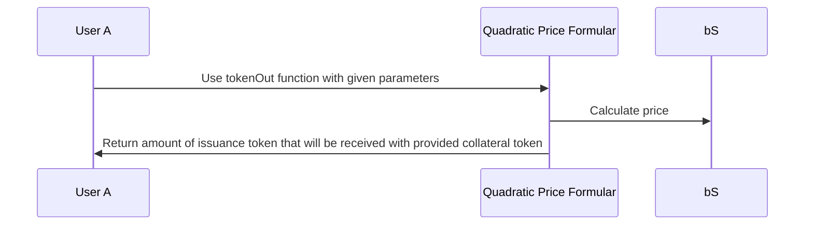

# Quadratic Price Formula

## UML Class Diagramm

## Purpose of this contract

The purpose of the Quadratic Price Formular is to calculate the price of a unit, based on the units availablility and the amount that is required to operate the system that this formula is used in. This unit is in the context of the inverter Bonding Curve system a ERC20 token.

## Basic Definitions

To understand the functionalities of the following contract it is important to understand the given definitions.

### Unit Availability (Capital Available)

The unit availability describes the amount of value stored in the network at any given point in time. In the quadratic price Formular the unit availability is described by the capital available value.

### Unit Requirements (Capital Required)

The Unit Requirements describe the amount of value that is needed to operate the protocol according to market size and conditions, the regulatory requirements, as well as the chosen risk. In the quadratic price Formular the unit requirements is described by the capital required value.

### Price per Unit

The price per unit is calculated by the formular with the capital available and capital required values and represents the amount of a different unit that is needed to buy one unit that is stored in the capital available value.

**Example**: Token B is representing the unit that capital available and capital required is using. A User has token B. The user wants to buy token A. The price of Token A relativ to Token B is calculated via the quadratic price Formular.

### Collateral Token

The Collateral Token in this scenario are the token that make up the capital available units. In the Example given in Price per Unit this would be Token B.

### Issuance Token

The Issuance Token in this scenario

## Inheritance

Because this contract is based on the ERC165 standard from OpenZeppelin, it inherits the given functionalities. These functionalities are described in the following sections:

**supportsInterface**: The supportsInterface function allows other contracts to check which Interfaces the Quadratic Price Formula contract implements. This is used to ensure type safety, which isn't natively supported by Solidity.

## Central Functions

**spotPrice**: This function computes the price for a given capital available and capital required.
**tokenOut**: This function computes the return amount of issuance token that will be received with the provided collateral token.
**tokenIn**: This function computes the return amount of collateral token that will be received with the provided issuance token.

## User Stories

The following sections describe the possible user stories in the Quadratic Price Formular contract:

### Spotprice

### tokenOut

### tokenIn

## Setup

For the contract setup there are no prerequisites needed.
