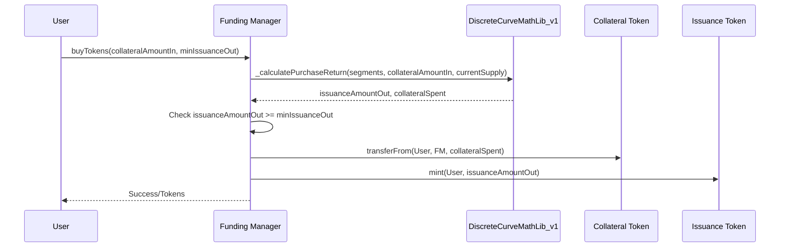

# DiscreteCurveMathLib_v1

## Purpose of Contract

The `DiscreteCurveMathLib_v1` is a Solidity library designed to provide mathematical operations for discrete bonding curves. Its primary purpose is to perform calculations related to price, collateral reserve, purchase returns (issuance out for collateral in), and sale returns (collateral out for issuance in) in a gas-efficient manner. This efficiency is achieved mainly through the use of packed storage for curve segment data. It is intended to be used by other smart contracts, such as Funding Managers, that implement bonding curve logic.

## Glossary

To understand the functionalities of this library and its context, it is important to be familiar with the following definitions.

| Definition              | Explanation                                                                                                                                                                                         |
| ----------------------- | --------------------------------------------------------------------------------------------------------------------------------------------------------------------------------------------------- |
| PP                      | Payment Processor module, typically handles queued payment operations.                                                                                                                              |
| FM                      | Funding Manager type module, which would utilize this library for its bonding curve calculations.                                                                                                   |
| Issuance Token          | Tokens that are distributed (minted/burned) by a Funding Manager contract, often based on the calculations provided by this library.                                                                |
| Discrete Bonding Curve  | A bonding curve where the price of the issuance token changes at discrete intervals (steps) rather than continuously.                                                                               |
| Segment                 | A distinct portion of the discrete bonding curve, defined by its own set of parameters: an initial price, a price increase per step, a supply amount per step, and a total number of steps.         |
| Step                    | The smallest unit within a segment where a specific quantity of issuance tokens (`supplyPerStep`) can be bought or sold at a fixed price.                                                           |
| PackedSegment           | A custom Solidity type (`type PackedSegment is bytes32;`) used by this library to store all four parameters of a curve segment into a single `bytes32` value. This optimizes storage gas costs.     |
| `PackedSegmentLib`      | A helper library (located in `../libraries/PackedSegmentLib.sol`), imported by `DiscreteCurveMathLib_v1`, responsible for the creation, validation, packing, and unpacking of `PackedSegment` data. |
| Scaling Factor (`1e18`) | A constant (`10^18`) used for fixed-point arithmetic to handle decimal precision for prices and token amounts, assuming standard 18-decimal tokens.                                                 |
| `MAX_SEGMENTS`          | A constant (`10`) defining the maximum number of segments a curve configuration can have, enforced by functions like `_validateSegmentArray` and `_calculateReserveForSupply`.                      |

## Implementation Design Decision

_The purpose of this section is to inform the user about important design decisions made during the development process. The focus should be on why a certain decision was made and how it has been implemented._

### Type-Safe Packed Storage for Segments

The core design decision for `DiscreteCurveMathLib_v1` is the use of **type-safe packed storage** for bonding curve segment data. Each segment's configuration (initial price, price increase per step, supply per step, and number of steps) is packed into a single `bytes32` slot using the custom type `PackedSegment` and the internal helper library `PackedSegmentLib`.

- **Why:** Storing an array of segments for a bonding curve can be gas-intensive if each segment's parameters occupy separate storage slots. By packing all parameters into one `bytes32` value, each segment effectively consumes only one storage slot when stored by a calling contract (e.g., in an array `PackedSegment[] storage segments;`). This significantly reduces gas costs for deployment and state modification of contracts that manage multiple curve segments.
- **How:** `PackedSegmentLib` defines the bit allocation for each parameter within the `bytes32` value, along with masks and offsets. It provides:
  - A `create` function that validates input parameters against their bit limits and packs them.
  - Accessor functions (`initialPrice`, `priceIncrease`, etc.) to retrieve individual parameters.
  - An `unpack` function to retrieve all parameters at once.
    The `PackedSegment` type itself (being `bytes32`) ensures type safety, preventing accidental mixing with other `bytes32` values that do not represent curve segments.

### Segment Validation Rules

To ensure economic sensibility and robustness, `DiscreteCurveMathLib_v1` and its helper `PackedSegmentLib` enforce specific validation rules for segment configurations:

1.  **No Free Segments (`PackedSegmentLib._create`)**:
    Segments that are entirely "free" – meaning their `initialPrice` is 0 AND their `priceIncreasePerStep` is also 0 – are disallowed. Attempting to create such a segment will cause `PackedSegmentLib._create()` to revert with the error `IDiscreteCurveMathLib_v1.DiscreteCurveMathLib__SegmentIsFree()`. This prevents scenarios where tokens could be minted indefinitely at no cost from a segment that never increases in price.

2.  **Non-Decreasing Price Progression (`DiscreteCurveMathLib_v1._validateSegmentArray`)**:
    When an array of segments is validated using `DiscreteCurveMathLib_v1._validateSegmentArray()`, the library checks for logical price progression between consecutive segments. Specifically, the `initialPrice` of any segment `N+1` must be greater than or equal to the calculated final price of the preceding segment `N`. The final price of segment `N` is determined as `segments[N]._initialPrice() + (segments[N]._numberOfSteps() - 1) * segments[N]._priceIncrease()`.
    If this condition is violated (i.e., if a subsequent segment starts at a lower price than where the previous one ended), `_validateSegmentArray()` will revert with the error `IDiscreteCurveMathLib_v1.DiscreteCurveMathLib__InvalidPriceProgression(uint256 segmentIndex, uint256 previousSegmentFinalPrice, uint256 nextSegmentInitialPrice)`.
    This rule ensures a generally non-decreasing (or strictly increasing, if price increases are positive) price curve across the entire set of segments.

3.  **Specific Segment Structure ("True Flat" / "True Sloped") (`PackedSegmentLib._create`)**:
    `PackedSegmentLib._create()` enforces specific structural rules for segments:
    - A "True Flat" segment must have `numberOfSteps == 1` and `priceIncreasePerStep == 0`. Attempting to create a multi-step flat segment (e.g., `numberOfSteps > 1` and `priceIncreasePerStep == 0`) will revert with `IDiscreteCurveMathLib_v1.DiscreteCurveMathLib__InvalidFlatSegment()`.
    - A "True Sloped" segment must have `numberOfSteps > 1` and `priceIncreasePerStep > 0`. Attempting to create a single-step sloped segment (e.g., `numberOfSteps == 1` and `priceIncreasePerStep > 0`) will revert with `IDiscreteCurveMathLib_v1.DiscreteCurveMathLib__InvalidPointSegment()`.
      These rules ensure that segments are clearly defined as either single-step fixed-price points or multi-step incrementally priced slopes. The `priceIncreasePerStep` being `uint256` inherently prevents price decreases within a single segment.

**Other Important Validation Rules & Errors:**

- **No Segments Configured (`_validateSegmentArray`, `_calculateReserveForSupply`, `_calculatePurchaseReturn` via internal checks):** If an operation requiring segments is attempted but no segments are defined (e.g., `segments_` array is empty), the library may revert with `IDiscreteCurveMathLib_v1.DiscreteCurveMathLib__NoSegmentsConfigured()`.
- **Too Many Segments (`_validateSegmentArray`, `_calculateReserveForSupply`):** If the provided `segments_` array exceeds `MAX_SEGMENTS` (currently 10), relevant functions will revert with `IDiscreteCurveMathLib_v1.DiscreteCurveMathLib__TooManySegments()`.
- **Supply Exceeds Curve Capacity (`_validateSupplyAgainstSegments`, `_findPositionForSupply`):** If a target supply or current supply exceeds the total possible supply defined by all segments, functions will revert with `IDiscreteCurveMathLib_v1.DiscreteCurveMathLib__SupplyExceedsCurveCapacity(uint256 currentSupplyOrTarget, uint256 totalCapacity)`.
- **Zero Collateral Input (`_calculatePurchaseReturn`):** Attempting a purchase with zero collateral reverts with `IDiscreteCurveMathLib_v1.DiscreteCurveMathLib__ZeroCollateralInput()`.
- **Zero Issuance Input (`_calculateSaleReturn`):** Attempting a sale with zero issuance tokens reverts with `IDiscreteCurveMathLib_v1.DiscreteCurveMathLib__ZeroIssuanceInput()`.
- **Insufficient Issuance to Sell (`_calculateSaleReturn`):** Attempting to sell more tokens than the `currentTotalIssuanceSupply` reverts with `IDiscreteCurveMathLib_v1.DiscreteCurveMathLib__InsufficientIssuanceToSell(uint256 tokensToSell, uint256 currentSupply)`.

_Note: All custom errors mentioned (e.g., `DiscreteCurveMathLib__SegmentIsFree`, `DiscreteCurveMathLib__InvalidPriceProgression`, `DiscreteCurveMathLib__InvalidFlatSegment`, `DiscreteCurveMathLib__InvalidPointSegment`, `DiscreteCurveMathLib__NoSegmentsConfigured`, `DiscreteCurveMathLib__TooManySegments`, `DiscreteCurveMathLib__SupplyExceedsCurveCapacity`, `DiscreteCurveMathLib__ZeroCollateralInput`, `DiscreteCurveMathLib__ZeroIssuanceInput`, `DiscreteCurveMathLib__InsufficientIssuanceToSell`) must be defined in the `IDiscreteCurveMathLib_v1.sol` interface file for the contracts to compile and function correctly._

### Efficient Calculation Methods

To further optimize gas for on-chain computations:

- **Arithmetic Series for Reserve/Cost Calculation:** For sloped segments (where `priceIncreasePerStep > 0`), functions like `_calculateReserveForSupply` (and its internal helper `_calculateSegmentReserve`) use the mathematical formula for the sum of an arithmetic series. This allows calculating the total collateral for multiple steps without iterating through each step individually, saving gas.
- **Direct Iteration for Purchase Calculation:** The `_calculatePurchaseReturn` function uses a direct iterative approach to determine the number of tokens to be minted for a given collateral input. It iterates through the curve segments and steps, calculating the cost for each, until the provided collateral is exhausted or the curve capacity is reached.
- **Optimized Sale Calculation:** The `_calculateSaleReturn` function determines the collateral out by calculating the total reserve locked in the curve before and after the sale, then taking the difference. This approach (`R(S_current) - R(S_final)`) is generally more efficient than iterating backward through curve steps. It leverages the internal helper `_calculateReservesForTwoSupplies` to efficiently get both reserve values in a single pass.

**Internal Helper Functions for Calculation:**
The library utilizes several internal helper functions to achieve its calculations efficiently and maintain modularity:

- `_validateSupplyAgainstSegments`: Ensures a given supply is consistent with the curve's capacity.
- `_calculateSegmentReserve`: Calculates the reserve for a portion of a single segment, handling flat and sloped logic.
- `_calculateReservesForTwoSupplies`: An optimized helper for `_calculateSaleReturn` that calculates reserves for two different supply points in one pass.
  While these are internal, understanding their role can be helpful for a deeper analysis of the library's mechanics.

### Limitations of Packed Storage and Low-Priced Collateral

While `PackedSegment` offers significant gas savings, its fixed bit allocation for price and supply parameters introduces limitations, particularly when dealing with collateral tokens that have a very low price per unit but maintain a high decimal precision (e.g., 18 decimals).

**The Core Issue:**
The `initialPrice` and `priceIncrease` fields currently use 72 bits each.

- Maximum value: `2^72 - 1` (approx. `4.722 x 10^21`) wei.
- For a standard 18-decimal token, this translates to a maximum representable price of approx. `4,722,366.48` tokens.

**Impact of Low-Priced Collateral:**
If a collateral token is worth, for example, **$0.000001** (one micro-dollar) and has 18 decimals:

- The maximum dollar value that can be represented for `initialPrice` or `priceIncrease` is `4,722,366.48 tokens * $0.000001/token = ~$4.72`.
  This means a bonding curve segment could not have an initial step price or a price increment (if denominated in such a collateral token) that represents more than ~$4.72 worth of that token.

**Example: Extremely Low-Priced Token**
Consider a hypothetical 18-decimal token worth **$0.0000000001** (one-tenth of a nano-dollar).

- To represent $1.00 worth of this token, one would need `1 / $0.0000000001 = 10,000,000,000` tokens.
- In wei (18 decimals): `10,000,000,000 * 1e18 = 1e28` wei.
  This value (`1e28` wei) significantly exceeds the `2^72 - 1` (approx. `4.7e21`) wei capacity of the 72-bit price fields, leading to an overflow if one tried to set a price step equivalent to $1.00 of this token.

**Potential Solutions and Workarounds:**

1.  **Collateral Token Choice & Decimal Precision:**

    - Using collateral tokens with fewer decimals (e.g., 6 or 8, like many stablecoins) significantly increases the nominal range.
    - Protocols can restrict collateral to tokens that fit reasonably within the existing bit allocation.

2.  **Price Scaling Factor:**

    - The bonding curve logic (in the consuming contract) could implement an additional scaling factor for prices. For example, a `PRICE_SCALING_FACTOR` of `1e12` could be used. A packed price of `1` would then represent an actual price of `1 * 1e12`. This allows storing scaled-down values in `PackedSegment` while representing larger actual prices.

3.  **Alternative Bit Allocation in `PackedSegment`:**

    - A future version of the library or a different packing scheme could allocate more bits to price fields (e.g., 96 bits) at the expense of bits for supply or by using more than one `bytes32` slot per segment if necessary. For instance, allocating 96 bits for price would allow values up to `2^96 - 1` (approx. `7.9e28` wei), accommodating even extremely low-priced 18-decimal tokens.

4.  **Protocol-Level Policies:**
    - **Collateral Whitelisting:** Enforce requirements on collateral tokens, such as minimum price or maximum effective decimals, to ensure compatibility.
    - **Dynamic Configuration:** Allow curve deployers to specify bit allocations or scaling factors per curve instance, though this adds complexity.

**Assessment for Current `DiscreteCurveMathLib_v1`:**
The current 72-bit allocation for prices is a deliberate trade-off favoring gas efficiency and is generally sufficient for many common use cases, especially with typical collateral like ETH, wBTC, or stablecoins (USDC, USDT, DAI) which have prices or decimal counts that fit well. For protocols like House Protocol, which are likely to use established stablecoins, the existing 72-bit precision for prices should provide ample headroom.

The library is well-suited for its primary intended applications. If support for extremely micro-cap tokens with high decimal precision becomes a strict requirement, deploying a new version of the library with adjusted bit allocations or incorporating an explicit price scaling mechanism in the consuming contract would be the recommended approaches.

### Internal Functions and Composability

Most functions in the library are `internal pure`, designed to be called by other smart contracts (typically Funding Managers). This makes the library a set of reusable mathematical tools rather than a standalone stateful contract. The `using PackedSegmentLib for PackedSegment;` directive enables convenient syntax for accessing segment data (e.g., `mySegment._initialPrice()`).

## Inheritance

### UML Class Diagram

_This diagram illustrates the relationships between the library, its internal helper library, and associated types/interfaces._

```mermaid
classDiagram
    direction LR
    note "DiscreteCurveMathLib_v1 is a Solidity library providing pure functions for bonding curve calculations."

    class DiscreteCurveMathLib_v1 {
        <<library>>
        +SCALING_FACTOR : uint256
        +MAX_SEGMENTS : uint256
        ---
        #_findPositionForSupply(PackedSegment[] memory, uint256) internal pure returns (uint segmentIndex, uint stepIndexWithinSegment, uint priceAtCurrentStep)
        #_calculateReserveForSupply(PackedSegment[] memory, uint256) internal pure returns (uint256 totalReserve_)
        #_calculatePurchaseReturn(PackedSegment[] memory, uint256, uint256) internal pure returns (uint256 tokensToMint_, uint256 collateralSpentByPurchaser_)
        #_calculateSaleReturn(PackedSegment[] memory, uint256, uint256) internal pure returns (uint256 collateralToReturn_, uint256 tokensToBurn_)
        #_createSegment(uint256, uint256, uint256, uint256) internal pure returns (PackedSegment)
        #_validateSegmentArray(PackedSegment[] memory) internal pure
        #_validateSupplyAgainstSegments(PackedSegment[] memory, uint256) internal pure returns (uint totalCurveCapacity_)
        #_calculateReservesForTwoSupplies(PackedSegment[] memory, uint256, uint256) internal pure returns (uint lowerReserve_, uint higherReserve_)
        #_calculateSegmentReserve(uint256, uint256, uint256, uint256) internal pure returns (uint collateral_)
    }

    class PackedSegmentLib {
        <<library>>
        -INITIAL_PRICE_BITS : uint256
        -PRICE_INCREASE_BITS : uint256
        -SUPPLY_BITS : uint256
        -STEPS_BITS : uint256
        ---
        #_create(uint256, uint256, uint256, uint256) internal pure returns (PackedSegment)
        #_initialPrice(PackedSegment) internal pure returns (uint256)
        #_priceIncrease(PackedSegment) internal pure returns (uint256)
        #_supplyPerStep(PackedSegment) internal pure returns (uint256)
        #_numberOfSteps(PackedSegment) internal pure returns (uint256)
        #_unpack(PackedSegment) internal pure returns (uint256, uint256, uint256, uint256)
    }

    class PackedSegment {
        <<type is bytes32>>
        note "User-defined value type wrapping bytes32"
    }

    class IDiscreteCurveMathLib_v1 {
        <<interface>>
        +Errors...
        +Events...
        // Note: CurvePosition struct might be defined here if used by _findPositionForSupply's NatSpec,
        // but the function itself returns a tuple.
        // SegmentConfig struct is not directly used by _createSegment's signature.
    }

    note for DiscreteCurveMathLib_v1 "Uses PackedSegmentLib for segment data manipulation"
    DiscreteCurveMathLib_v1 ..> PackedSegmentLib : uses
    note for DiscreteCurveMathLib_v1 "Operates on PackedSegment data"
    DiscreteCurveMathLib_v1 ..> PackedSegment : uses
    note for DiscreteCurveMathLib_v1 "References error definitions from the interface"
    DiscreteCurveMathLib_v1 ..> IDiscreteCurveMathLib_v1 : uses (errors)

    note for PackedSegmentLib "Creates and unpacks PackedSegment types"
    PackedSegmentLib ..> PackedSegment : manipulates
    note for PackedSegmentLib "References error definitions from the interface for validation"
    PackedSegmentLib ..> IDiscreteCurveMathLib_v1 : uses (errors)

```



### Base Contracts

`DiscreteCurveMathLib_v1` is a Solidity library and does not inherit from any base contracts. It is a standalone collection of functions.

### Key Changes to Base Contract

Not applicable, as this is a library, not an upgrade or modification of a base contract.

## User Interactions

_This library itself does not have direct user interactions with state changes. It provides pure functions to be used by other contracts (e.g., a Funding Manager). Below are examples of how a calling contract might use this library._

### Example: Calculating Purchase Return

A Funding Manager (FM) contract would use `_calculatePurchaseReturn` to determine how many issuance tokens a user receives for a given amount of collateral.

**Preconditions (for the FM, not the library call itself):**

- The FM has access to the array of `PackedSegment` data defining the curve.
- The FM knows the `currentTotalIssuanceSupply` of its token.
- The user (caller of the FM) has sufficient collateral and has approved it to the FM.

1.  **FM calls `_calculatePurchaseReturn` from the library:**
    The FM passes its segment data, the user's `collateralAmountIn`, and the `currentTotalIssuanceSupply` to the library function.

    ```solidity
    // In a Funding Manager contract
    // import {DiscreteCurveMathLib_v1, PackedSegment} from ".../DiscreteCurveMathLib_v1.sol";
    //
    // PackedSegment[] internal _segments;
    // IERC20 public _issuanceToken; // Assume it has a totalSupply()
    // IERC20 public _collateralToken;

    function getPurchaseReturn(uint256 collateralAmountIn)
        public
        view
        returns (uint256 issuanceAmountOut, uint256 collateralAmountSpent)
    {
        // This is a simplified example. A real FM would get _segments from storage.
        // PackedSegment[] memory currentSegments = _segments; // If _segments is storage array
        // For this example, assume segments are passed or constructed.
        PackedSegment[] memory segments = new PackedSegment[](1); // Example segments
        segments[0] = DiscreteCurveMathLib_v1._createSegment(1e18, 0.1e18, 10e18, 100);


        // uint256 currentTotalIssuanceSupply = _issuanceToken.totalSupply(); // Get current supply

        // For example purposes, let's assume a current supply
        uint256 currentTotalIssuanceSupply = 50e18;


        (issuanceAmountOut, collateralAmountSpent) =
            DiscreteCurveMathLib_v1._calculatePurchaseReturn(
                segments,
                collateralAmountIn,
                currentTotalIssuanceSupply
            );
    }
    ```

2.  **FM uses the result:**
    The FM would then use `issuanceAmountOut` and `collateralAmountSpent` to handle the token transfers (take collateral, mint issuance tokens).

**Sequence Diagram (Conceptual for FM using the Library)**



## Deployment

### Preconditions

`DiscreteCurveMathLib_v1` is a library. It is not deployed as a standalone contract instance that holds state or requires ownership. Libraries are typically linked by other contracts during their compilation/deployment.

A contract intending to _use_ this library would need:

- An array of `PackedSegment` data, correctly configured and validated, representing its desired bonding curve. This data would typically be initialized in the constructor or a setup function of the consuming contract.

### Deployment Parameters

Not applicable. Libraries do not have constructors or `init()` functions in the same way contracts do.

### Deployment

The library's code is included in contracts that use it. When a contract using `DiscreteCurveMathLib_v1` is compiled and deployed:

- If all library functions are `internal`, the library code is embedded directly into the consuming contract's bytecode.
- If the library had `public` or `external` functions (which `DiscreteCurveMathLib_v1` does not, for its core logic), it might need to be deployed separately and linked, but this is not the case here for its primary usage pattern.

Deployment of contracts _using_ this library would follow standard Inverter Network procedures:

- **Manual deployment:** Through Inverter Network's [Control Room application](https://beta.controlroom.inverter.network/).
- **SDK deployment:** Through Inverter Network's [TypeScript SDK](https://docs.inverter.network/sdk/typescript-sdk/guides/deploy-a-workflow) or [React SDK](https://docs.inverter.network/sdk/react-sdk/guides/deploy-a-workflow).

### Setup Steps

Not applicable for the library itself. A contract using this library (e.g., a Funding Manager) would require setup steps to define its curve segments. This typically involves:

1.  **Preparing Segment Data**: For each segment, the individual parameters (`initialPrice_`, `priceIncrease_`, `supplyPerStep_`, `numberOfSteps_`) need to be determined. While an off-chain script or helper might use a struct similar to `SegmentConfig` for convenience, the library's `_createSegment` function takes these as individual arguments.
2.  **Creating PackedSegments**: Iterating through the prepared segment data and calling `DiscreteCurveMathLib_v1._createSegment()` for each set of parameters to get the `PackedSegment` bytes32 value. `PackedSegmentLib` (used by `_createSegment`) will validate individual parameters.
3.  **Storing PackedSegments**: Storing the resulting `PackedSegment[]` array in the consuming contract's state.
4.  **Validating Segment Array**: Validating the entire `PackedSegment[]` array using `DiscreteCurveMathLib_v1._validateSegmentArray()` to check for array-level properties like `MAX_SEGMENTS` and correct inter-segment price progression.

The NatSpec comments within `DiscreteCurveMathLib_v1.sol` and `IDiscreteCurveMathLib_v1.sol` provide details on function parameters and errors, which would be relevant for developers integrating this library.
