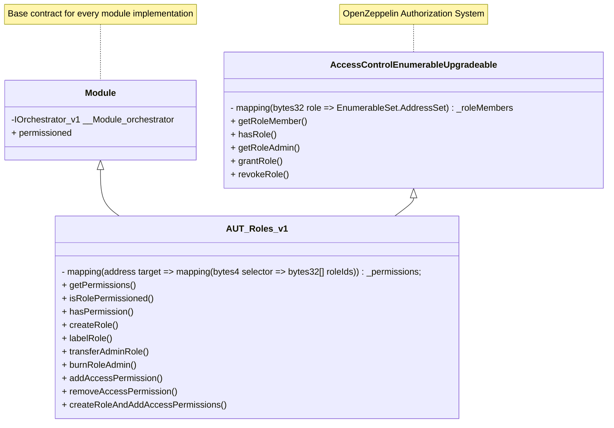

# AUT_Roles_v2

## Purpose of Contract

This contract provides the access control mechanism for managing roles and permissions across different modules within the Inverter Network, ensuring secure and controlled access to critical functionalities.

This contract has the following key features:

- **Role creation and management**: This includes the ability to create roles, revoke roles, assigning and revoking role admins, which can add and remove role members.
- **Role-based access control**: This includes the ability to grant roles access to functions that implement the permissioned modifier. Functions can also be set to public access by adding the public role to the function permissions.

## Glossary

To understand the functionalities of the following contract, it is important to be familiar with the following definitions.

### Roles

A role has the following properties:

- A unique identifier (ID)
- A label
- A list of members
- A associated admin role

The id is a value assigned by the authorizer module and is used to reference the role in the different functions of the authorizer module.

The label is a string that is emitted as an event when the role is created. It is used to make the role human readable in the frontend and has no practical use in the
onchain live setup.

The members are the addresses that inhabit the role. The admin role is the role that can add and remove new members to the role.

### Native Roles

There are three native roles that are created with the authorizer module:

- The default admin role
- The public role
- The burn admin role

The default admin role holds the highest admin privileges and can access every permissioned function at all times. The public role is a role that can be added to a function's permission list and is used to make functions be publicly accessible. The burn admin role is a placeholder role that indicates that the admin role of a role has been burned and is no longer usable.

### Permissioned Modifier

Most of the state altering functions in a workflow are so called permissioned functions. This means that only roles that have been granted the according function permission can call the function. The permissioned status is enforced by the `permissioned` modifier.

Some of the native roles have special rights in this system. The default admin role can access every permissioned function regardless of wether the default admin role was granted the permission or not. If the public role is granted the permission to a function, then every caller can access the function, regardless of
wether they inhabit a already added role or not.

Note: As a workflow is intialized without any native permissions, some functions that could be perceived as "this should be publicly accessible" are not. Examples for this could be the "buy" and "sell" functions of some funding manager modules or the stake and unstake functions of the staking logic module. For these functions, the public role has to be added to the access of the respective function.

## Inheritance

### Class Diagramm



### Base Contracts

This contract is based on the following contracts and inherits their functionalities:

- [IAuthorizer_v2](../IAuthorizer_v2.md): Implementation interface.
- [Module_v1](../../base/Module_v1.md): Inverter network base module functionality.
- [AccessControlEnumerableUpgradeable](https://github.com/OpenZeppelin/openzeppelin-contracts-upgradeable/blob/master/contracts/access/extensions/AccessControlEnumerableUpgradeable.sol): Access control functionality.

Functions that have been overridden to adapt functionalities are outlined below.

### Key Changes to the Base Contracts

_The purpose of this section is to highlight which functions of the base contract have been overridden and why._

- `grantRole`: This function has been overridden to allow only the distribution of roles that have already been created by the authorizer module.

## Key Functionalities

In this section the key functionalities of the authorizer module are described.

### Role Management

This section describes the functionalities of the authorizer module regarding role management.

#### Role Creation

A role can be created by calling the createRole function. The function takes the following parameters:

- The role name
- The role id of the role that will become the admin of the new role.
- The addresses of the initial members of the new role.

The rolename in this context refers to the label of the role and is therefor not referenceable onchain. The function can only be called by a permissioned address (See [permissioned](#permissioned-modifier)).

#### Role Labeling

The label of a role can be overwritten by calling the labelRole function. With this a new event is emitted, that signals the frontend that the label has been updated. The function can only be called by a permissioned address.(See [permissioned](#permissioned-modifier)).

#### Role granting

A role can be granted to a address by calling the grantRole function. The function takes the following parameters:

- The role id of the role to grant
- The address to grant the role to

The grantRole function can only be called by according admin of the role.

#### Role revoking

A role can be revoked from an address by calling therevokeRole function. The function takes the following parameters:

- The role id of the role to revoke
- The address to revoke the role from

The revokeRole function can only be called by according admin of the role.

#### Transferal of Admin Roles

The admin role of a role can be transferred by calling the transferAdminRole function. The function takes the following parameters:

- The role id of the role to transfer the admin from
- The role id of the role to transfer the admin to

The transferAdminRole function can only be called by according admin of the role.

#### Burning of Admin Roles:

The admin role can be burned by calling the burnRoleAdmin function. The function takes the following parameters:

- The role id of the role to burn the admin from

If the admin role is burned, then no members can be added or removed from a role anymore. Remember: This step is irreversible.

### Role Based Access Control

This section describes the functionalities of the authorizer module regarding role based access control.

#### Adding access permissions

Adding access permissions is done by calling the `addAccessPermission` function. This function takes the following parameters:

- The contract for which the permission is added
- The function selector of the target function
- The role ID of the role that will receive the permission

Example: Adding the role "BOUNTY_MANAGER" to the "createBounty" function of the "bountyManager" contract would look like this:

```solidity
authorizer.addAccessPermission(
    address(bountyManager),
    bountyManager.createBounty.selector,
    bountyManagerId
);
```

The function can only be called by a permissioned address.(See [permissioned](#permissioned-modifier)).

#### Making a function public

A function can be made public by calling the `addAccessPermission` function with the public role as target role.

Example: Making the "buy" function of the funding manager contract public would look like this:

```solidity
authorizer.addAccessPermission(
    address(fundingManager),
    fundingManager.buy.selector,
    authorizer.PUBLIC_ROLE()
);`
```

The public role can be removed in the same way as any other role.

### Mixed Utility - createRoleAndAddAccessPermissions()

This function is a convenience function that combines the creation of a new role and the adding of access permissions. It takes the following parameters:

- The name of the role
- The role id of the role that will become the admin of the new role.
- The addresses of the initial members of the new role.
- The addresses of the targets contracts.
- The selectors of the functions.

Note: The selectors of the functions are linked to the respective target contracts. As the selectors are passedas a 2 Dimensional array, the first dimension is coupled to target contract and the second one contains the actual selectors for that target contract.

Example: The target contracts are the fundingManager at position 0 in the array and the logic module at position 1. The selectors therefor contain two arrays, one for position 0 and one for position 1. A call would look like this:

```solidity
'authorizer.createRoleAndAddAccessPermissions(
    "newRole",
    authorizer.DEFAULT_ADMIN_ROLE(),
    [
        initialMember1,
        initialMember2
    ],
    [
        fundingManager.address,
        logicModule.address
    ],
    [
        [
            fundingManager.buy.selector,
            fundingManager.sell.selector
        ],
        [
            logicModule.execute.selector
        ]
    ]
)
```

The function can only be called by a permissioned address.(See [permissioned](#permissioned-modifier)).

## Deployment

### Deployment Parameters

The list of deployment parameters can be found in the _Technical Reference_ section of the documentation under the `init()` function ([https://docs.inverter.network/contracts/technical-reference/modules/authorizer/role/aut_roles_v2.sol]()).

### Deployment

Deployment should be done using one of the methods provided below:

- **Manual deployment:** Through Inverter Network's [Control Room application](https://beta.controlroom.inverter.network/).
- **SDK deployment:** Through Inverter Network's [TypeScript SDK](https://docs.inverter.network/sdk/typescript-sdk/guides/deploy-a-workflow) or [React SDK](https://docs.inverter.network/sdk/react-sdk/guides/deploy-a-workflow).

### Setup Steps

#### Optional Setup Steps

Because a workflow and its authorizer module are deployed without any native permissions (except the initial admin role [here](#native-roles)), it might be necessary for some modules to modify the access of their functions. For this the sections [Mixed Utility](#mixed-utility---createroleandaddaccesspermissions), [Role Management](#role-management) and [Role Based Access Control](#role-based-access-control) can be referenced.
