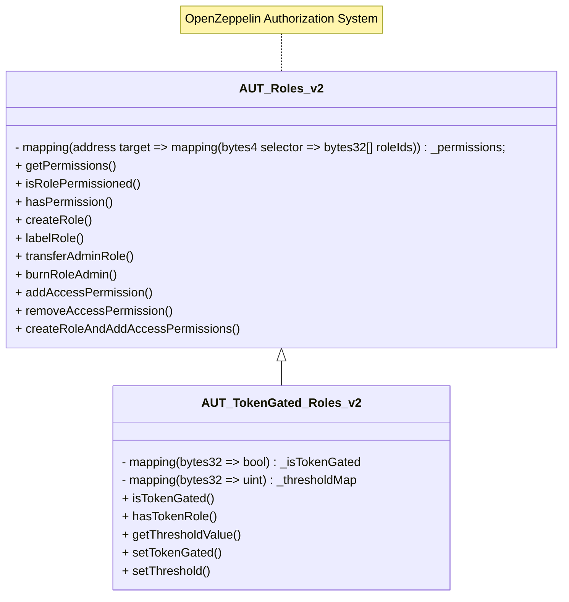
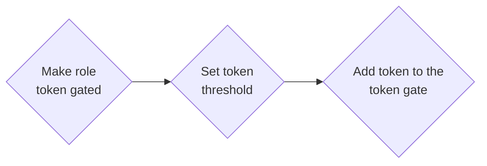

# AUT_TokenGated_Roles_v2

## Purpose of Contract

This contract extends the Inverter's role-based access control to include token gating, enabling roles to be conditionally assigned based on token ownership. This mechanism allows for dynamic permissioning tied to specific token holdings.

This contract has the following key features:

- Token-based access checks before role assignment.
- Supports both {ERC20} and {ERC721} tokens.

## Glossary

To understand the functionalities of the following contract, it is important to be familiar with the following definitions.

### Token Gated Role

With this contract it is possible to extend the base functionality of the [AUT_Roles_v2](./AUT_Roles_v2.md) contract to make a role token gated. A token gated role behaves in all respects like a regular role, but handles the membership of that role differently. A member of a token gated role is only allowed to access the role functionalities if they hold a certain amount of a token.

The implementation of this contract uses a few tricks to achieve this. Without going into too much detail, this is the main part that is needed to understand the basic mechanism:

In the contract, token gating is implemented by storing the token address in the role’s members property, instead of directly listing user addresses. This setup allows the contract to check the token balance of a user against a defined threshold when access is requested.

Example: We want to restrict a role to users who hold a certain amount of Token A. Therefore, we configure the role to be token-gated and set a required token amount the user needs to hold as threshold. When we then call `grantRole` with the address of Token A, the role becomes accessible only to users whose wallet holds at least the specified amount of that token.

## Inheritance

### Class Diagramm



### Base Contracts

This contract is based on the following contracts and inherits their functionalities:

- [IAUT_TokenGated_Roles_v2](./interfaces/IAUT_TokenGated_Roles_v2.md): Implementation interface.
- [Module_v2](../../base/Module_v2.md): Inverter network base module functionality.
- [AccessControlEnumerableUpgradeable](https://github.com/OpenZeppelin/openzeppelin-contracts-upgradeable/blob/master/contracts/access/extensions/AccessControlEnumerableUpgradeable.sol): Access control functionality.
- [AUT_Roles_v2](./AUT_Roles_v2.md): Base contract for the role-based access control.

Functions that have been overridden to adapt functionalities are outlined below.

### Key Changes to the Base Contracts

_The purpose of this section is to highlight which functions of the base contract have been overridden and why._

- `hasRole`: This function has been overridden to allow token gating.
- `grantRole`: This function has been overridden to allow token gating.
- `revokeRole`: This function has been overridden to allow token gating.

## Key Functionalities

In this section the key functionalities of the authorizer module are described.

### Token based Access Control

This section describes the functionalities of the authorizer module regarding token based access control.

#### Making a role token gated

Making a role token gated is done by calling the `setTokenGated` function. This function takes the following parameters:

- The role id of the role that we change the token gated status of.
- The boolean that indicates if the role should be token gated or not.

When calling this function, the role can not contain any members, when it is switched to and from token gated.

Example: Making the role "Whitelisted" token gated would look like this:

```solidity
authorizer.setTokenGated(
    whitelistedRoleId,
    true
);
```

The function can only be called by a permissioned address (See [permissioned](#permissioned-modifier)).

#### Setting the token threshold

Setting the token threshold needed to pass the token gate is done by calling the `setTokenThreshold` function. This function takes the following parameters:

- The role id of the role to set the threshold for.
- The address of the token to set the threshold for.
- The threshold value to set.

Example: Setting the threshold for the token "USDC" to 100 would look like this:

```solidity
authorizer.setTokenThreshold(
    whitelistedRoleId,
    USDC,
    100
);
```

The function can only be called by a permissioned address (See [permissioned](#permissioned-modifier)).

#### Adding a token to the token gate

Adding a token to the token gate is done by calling the `grantRole` function. This function takes the following parameters:

- The role id of the role to grant.
- The address of the token to grant the role to.

The grantRole function can only be called by according admin of the role.
Example: Adding a token gate to the token gated role "Whitelisted" would look like this:

```solidity
authorizer.grantRole(
    whitelistedRoleId,
    address(USDC)
);
```

#### Removing a token from the token gate

Remove a token from the token gate is done by calling the `revokeRole` function. This function behaves like the regular revokeRole function, except that it sets the threshold for the role and token combination to 0 as well.
Example: Removing the token from the role "Whitelisted" would look like this:

```solidity
authorizer.revokeRole(
    whitelistedRoleId,
    address(USDC)
);
```

#### Reversing a token gate

In case the token gated status of a role needs to be reverted, the `setTokenGated` function can be used. The same restrictions as for the `setTokenGated` function apply here as well (see above).

Example: Reversing the token gated status of the role "Whitelisted" would look like this:

```solidity
authorizer.setTokenGated(
    whitelistedRoleId,
    false
);
```

### Full process of making a role token gated

To make a role token gated, the following steps need to be taken in order:



The first step is to make the role token gated. This is done by calling the `setTokenGated` function (see [here](#making-a-role-token-gated)). Remember that this function can only be called by a permissioned address and can not contain any members, when it is switched to and from token gated.

The second step is to set the threshold for the role and token combination. This is done by calling the `setTokenThreshold` function (see [here](#setting-the-token-threshold)). This function is also permissioned.

The third step is to actually add the token to the token gate. This is done by calling the `grantRole` function (see [here](#adding-a-token-to-the-token-gate)). This function can only be called by according admin of the role.

## Deployment

### Deployment Parameters

The list of deployment parameters can be found in the _Technical Reference_ section of the documentation under the `init()` function ([https://docs.inverter.network/contracts/technical-reference/modules/authorizer/role/AUT_TokenGated_Roles_v2.sol]()).

### Deployment

Deployment should be done using one of the methods provided below:

- **Manual deployment:** Through Inverter Network's [Control Room application](https://beta.controlroom.inverter.network/).
- **SDK deployment:** Through Inverter Network's [TypeScript SDK](https://docs.inverter.network/sdk/typescript-sdk/guides/deploy-a-workflow) or [React SDK](https://docs.inverter.network/sdk/react-sdk/guides/deploy-a-workflow).

### Setup Steps

#### Optional Setup Steps

Because a workflow and its authorizer module are deployed without any native permissions (except the initial admin role [here](#native-roles)), it might be necessary for some modules to modify the access of their functions. For this look up the sections `Mixed Utility`,`Role Management` and `Role Based Access Control` from the [AUT_Roles_v2](./AUT_Roles_v2.md) as well as the section [Full process of making a role token gated](#full-process-of-making-a-role-token-gated).
