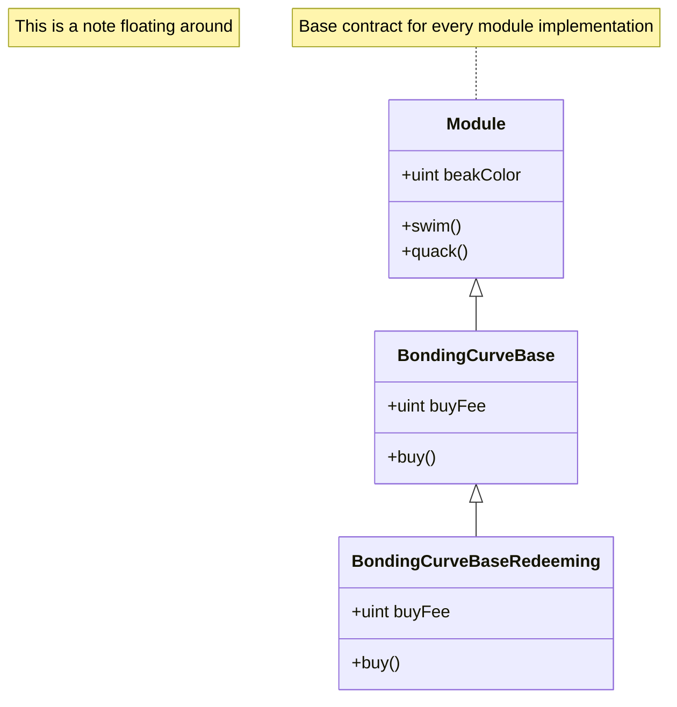
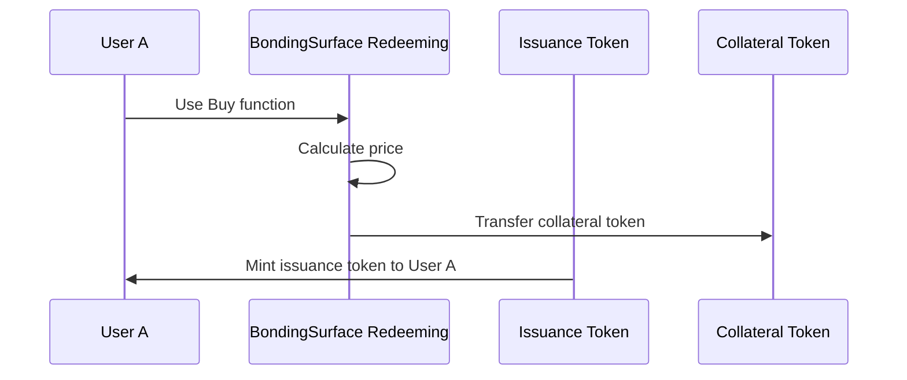

# Title of Contract

## Purpose of Contract
*A high-level purpose and description of the contract.*


## Glossary
To understand the functionalities of the following contract, it is important to be familiar with the following definitions.


| Definition     | Explanation                 |
| --------       | --------                    |
| PP             | Payment Processor           |
| FM             | Funding Manager type module |
| Issuance Token |  Issuance tokens are tokens that are distributed from the Funding Manager contract.    |
| Text | Text|
## Implementation Design Decision
*The purpose of this section is to inform the user about important design decisions made during the development process. The focus should be on why a certain decision was made and how it has been implemented.*

### (Example) Delayed redemptions through PP
The collateral from buy operations is not held in the FM. This creates a situation where instant redemptions cannot be enabled. To accommodate this, instead of instant redemptions, a payment order is created in the workflow's PP, adding the redemption order to a queue to be executed at a later stage.


## Inheritance
### UML Class Diagramm
*Use Mermaid `classDiagram` to create the UML Diagram of the Module*

### Base Contracts
The contract is based on the <Placeholder> and <Placeholder> contracts and inherits their functionalities. The base functionalities inherited can be found in the following links:

- <Placeholder_Docs_Link>
- <Placeholder_Docs_Link>
    
Functions that have been overridden to adapt functionalities are outlined below.
### Key Changes to Base Contract
*The purpose of this section is to highlight which functions of the base contract have been overridden and why.*

- (Example) `buy`: This function has been overridden to restrict interactions to addresses that have the WHITELIST_ROLE.
- (Example) `_projectFeeCollected`: This function has been overridden because the fee collected is not stored in the contract. Instead, only an event is emitted.


## User Interactions
*The purpose of this section is to highlight common user interaction flows, specifically those that involve a multi-step process. Please note that only the user interactions defined in this contract should be listed. Functionalities inherited from base contracts should be referenced accordingly.*

### (Example) Function: Buy
To execute a buy operation, the following steps should be taken
**Precondition**
- The caller has the `WHITELIST_ROLE`
- The caller has sufficiant collateral tokens
- The caller has the collateral token approved to the FM
1. **Get minAmountOut**:
    To protect against too much slipage, the minimum amount out is pre-computed
    ```solidity!
    uint depositAmount = 10e18;
    uint minAmountOut =             fundingManager.calculatePurchaseReturn(depositAmount);
    ```
2. **Call Buy Function**:
    ```solidity!
    fundingManager.buy(depositAmount, minAmountOut);
    ```
**Sequence Diagram**
    


## Deployment  

### Preconditions  
The following preconditions must be met before deployment:  
- **(Example) Issuance Token:** Ownership of a deployed token contract that implements the `IERC20Issuance_v1` interface to enable minting.  
- **(Example)** Etc.  

### Deployment Parameters  
The list of deployment parameters can be found in the *Technical Reference* section of the documentation under the `init()` function ([link]).  

### Deployment  
Deployment should be done using one of the methods provided below:  
- **Manual deployment:** Through Inverter Network's [Control Room application](https://beta.controlroom.inverter.network/).  
- **SDK deployment:** Through Inverter Network's [TypeScript SDK](https://docs.inverter.network/sdk/typescript-sdk/guides/deploy-a-workflow) or [React SDK](https://docs.inverter.network/sdk/react-sdk/guides/deploy-a-workflow).  

### Setup Steps  
After deployment, the mandatory and optional setup steps can be found in the contract NatSpec ([link]).  

