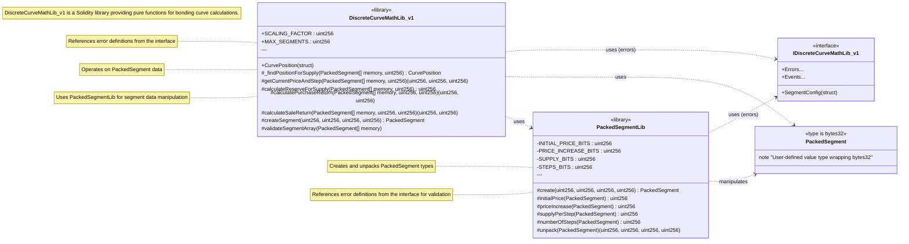
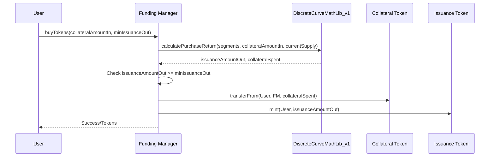

# DiscreteCurveMathLib_v1

## Purpose of Contract

The `DiscreteCurveMathLib_v1` is a Solidity library designed to provide mathematical operations for discrete bonding curves. Its primary purpose is to perform calculations related to price, collateral reserve, purchase returns (issuance out for collateral in), and sale returns (collateral out for issuance in) in a gas-efficient manner. This efficiency is achieved mainly through the use of packed storage for curve segment data. It is intended to be used by other smart contracts, such as Funding Managers, that implement bonding curve logic.

## Glossary

To understand the functionalities of this library and its context, it is important to be familiar with the following definitions.

| Definition              | Explanation                                                                                                                                                                                     |
| ----------------------- | ----------------------------------------------------------------------------------------------------------------------------------------------------------------------------------------------- |
| PP                      | Payment Processor module, typically handles queued payment operations.                                                                                                                          |
| FM                      | Funding Manager type module, which would utilize this library for its bonding curve calculations.                                                                                               |
| Issuance Token          | Tokens that are distributed (minted/burned) by a Funding Manager contract, often based on the calculations provided by this library.                                                            |
| Discrete Bonding Curve  | A bonding curve where the price of the issuance token changes at discrete intervals (steps) rather than continuously.                                                                           |
| Segment                 | A distinct portion of the discrete bonding curve, defined by its own set of parameters: an initial price, a price increase per step, a supply amount per step, and a total number of steps.     |
| Step                    | The smallest unit within a segment where a specific quantity of issuance tokens (`supplyPerStep`) can be bought or sold at a fixed price.                                                       |
| PackedSegment           | A custom Solidity type (`type PackedSegment is bytes32;`) used by this library to store all four parameters of a curve segment into a single `bytes32` value. This optimizes storage gas costs. |
| `PackedSegmentLib`      | An internal library within `DiscreteCurveMathLib_v1` responsible for the creation, validation, packing, and unpacking of `PackedSegment` data.                                                  |
| Scaling Factor (`1e18`) | A constant used for fixed-point arithmetic to handle decimal precision for prices and token amounts, assuming standard 18-decimal tokens.                                                       |

## Implementation Design Decision

_The purpose of this section is to inform the user about important design decisions made during the development process. The focus should be on why a certain decision was made and how it has been implemented._

### Type-Safe Packed Storage for Segments

The core design decision for `DiscreteCurveMathLib_v1` is the use of **type-safe packed storage** for bonding curve segment data. Each segment's configuration (initial price, price increase per step, supply per step, and number of steps) is packed into a single `bytes32` slot using the custom type `PackedSegment` and the internal helper library `PackedSegmentLib`.

- **Why:** Storing an array of segments for a bonding curve can be gas-intensive if each segment's parameters occupy separate storage slots. By packing all parameters into one `bytes32` value, each segment effectively consumes only one storage slot when stored by a calling contract (e.g., in an array `PackedSegment[] storage segments;`). This significantly reduces gas costs for deployment and state modification of contracts that manage multiple curve segments.
- **How:** `PackedSegmentLib` defines the bit allocation for each parameter within the `bytes32` value, along with masks and offsets. It provides:
  - A `create` function that validates input parameters against their bit limits and packs them.
  - Accessor functions (`initialPrice`, `priceIncrease`, etc.) to retrieve individual parameters.
  - An `unpack` function to retrieve all parameters at once.
    The `PackedSegment` type itself (being `bytes32`) ensures type safety, preventing accidental mixing with other `bytes32` values that do not represent curve segments.

### Segment Validation Rules

To ensure economic sensibility and robustness, `DiscreteCurveMathLib_v1` and its helper `PackedSegmentLib` enforce specific validation rules for segment configurations:

1.  **No Free Segments (`PackedSegmentLib.create`)**:
    Segments that are entirely "free" – meaning their `initialPrice` is 0 AND their `priceIncreasePerStep` is also 0 – are disallowed. Attempting to create such a segment will cause `PackedSegmentLib.create()` to revert with the error `IDiscreteCurveMathLib_v1.DiscreteCurveMathLib__SegmentIsFree()`. This prevents scenarios where tokens could be minted indefinitely at no cost from a segment that never increases in price.

2.  **Non-Decreasing Price Progression (`DiscreteCurveMathLib_v1.validateSegmentArray`)**:
    When an array of segments is validated using `DiscreteCurveMathLib_v1.validateSegmentArray()`, the library checks for logical price progression between consecutive segments. Specifically, the `initialPrice` of any segment `N+1` must be greater than or equal to the calculated final price of the preceding segment `N`. The final price of segment `N` is determined as `segments[N].initialPrice() + (segments[N].numberOfSteps() - 1) * segments[N].priceIncreasePerStep()`.
    If this condition is violated (i.e., if a subsequent segment starts at a lower price than where the previous one ended), `validateSegmentArray()` will revert with the error `IDiscreteCurveMathLib_v1.DiscreteCurveMathLib__InvalidPriceProgression(uint256 segmentIndex, uint256 previousSegmentFinalPrice, uint256 nextSegmentInitialPrice)`.
    This rule ensures a generally non-decreasing (or strictly increasing, if price increases are positive) price curve across the entire set of segments.

3.  **No Price Decrease Within Sloped Segments**:
    The `priceIncreasePerStep` parameter for a segment is a `uint256`. This inherently means that for any single sloped segment (where `priceIncreasePerStep > 0`), the price per step will only increase or stay the same (if `priceIncreasePerStep` was 0, but such segments are now handled by the "No Free Segments" rule if `initialPrice` is also 0, or they are flat segments if `initialPrice > 0`). Direct price decreases _within_ a single segment are not possible due to the unsigned nature of this parameter.

_Note: The custom errors `DiscreteCurveMathLib__SegmentIsFree` and `DiscreteCurveMathLib__InvalidPriceProgression` must be defined in the `IDiscreteCurveMathLib_v1.sol` interface file for the contracts to compile and function correctly._

### Efficient Calculation Methods

To further optimize gas for on-chain computations:

- **Arithmetic Series for Reserve/Cost Calculation:** For sloped segments (where `priceIncreasePerStep > 0`), functions like `calculateReserveForSupply` use the mathematical formula for the sum of an arithmetic series. This allows calculating the total collateral for multiple steps without iterating through each step individually, saving gas.
- **Linear Search for Purchases on Sloped Segments:** When calculating purchase returns on a sloped segment, the internal helper function `_calculatePurchaseForSingleSegment` (called by `calculatePurchaseReturn`) employs a linear search algorithm (`_linearSearchSloped`). This approach iterates step-by-step to determine the maximum number of full steps a user can afford with their input collateral. For scenarios where users typically purchase a small number of steps, linear search can be more gas-efficient than binary search due to lower overhead per calculation, despite a potentially higher number of iterations for very large purchases.
- **Optimized Sale Calculation:** The `calculateSaleReturn` function determines the collateral out by calculating the total reserve locked in the curve before and after the sale, then taking the difference. This approach (`R(S_current) - R(S_final)`) is generally more efficient than iterating backward through curve steps.

### Internal Functions and Composability

Most functions in the library are `internal pure`, designed to be called by other smart contracts (typically Funding Managers). This makes the library a set of reusable mathematical tools rather than a standalone stateful contract. The `using PackedSegmentLib for PackedSegment;` directive enables convenient syntax for accessing segment data (e.g., `mySegment.initialPrice()`).

## Inheritance

### UML Class Diagram

_This diagram illustrates the relationships between the library, its internal helper library, and associated types/interfaces._



### Base Contracts

`DiscreteCurveMathLib_v1` is a Solidity library and does not inherit from any base contracts. It is a standalone collection of functions.

### Key Changes to Base Contract

Not applicable, as this is a library, not an upgrade or modification of a base contract.

## User Interactions

_This library itself does not have direct user interactions with state changes. It provides pure functions to be used by other contracts (e.g., a Funding Manager). Below are examples of how a calling contract might use this library._

### Example: Calculating Purchase Return

A Funding Manager (FM) contract would use `calculatePurchaseReturn` to determine how many issuance tokens a user receives for a given amount of collateral.

**Preconditions (for the FM, not the library call itself):**

- The FM has access to the array of `PackedSegment` data defining the curve.
- The FM knows the `currentTotalIssuanceSupply` of its token.
- The user (caller of the FM) has sufficient collateral and has approved it to the FM.

1.  **FM calls `calculatePurchaseReturn` from the library:**
    The FM passes its segment data, the user's `collateralAmountIn`, and the `currentTotalIssuanceSupply` to the library function.

    ```solidity
    // In a Funding Manager contract
    // import {DiscreteCurveMathLib_v1, PackedSegment} from ".../DiscreteCurveMathLib_v1.sol";
    //
    // PackedSegment[] internal _segments;
    // IERC20 public _issuanceToken; // Assume it has a totalSupply()
    // IERC20 public _collateralToken;

    function getPurchaseReturn(uint256 collateralAmountIn)
        public
        view
        returns (uint256 issuanceAmountOut, uint256 collateralAmountSpent)
    {
        // This is a simplified example. A real FM would get _segments from storage.
        // PackedSegment[] memory currentSegments = _segments; // If _segments is storage array
        // For this example, assume segments are passed or constructed.
        PackedSegment[] memory segments = new PackedSegment[](1); // Example segments
        segments[0] = DiscreteCurveMathLib_v1.createSegment(1e18, 0.1e18, 10e18, 100);


        // uint256 currentTotalIssuanceSupply = _issuanceToken.totalSupply(); // Get current supply

        // For example purposes, let's assume a current supply
        uint256 currentTotalIssuanceSupply = 50e18;


        (issuanceAmountOut, collateralAmountSpent) =
            DiscreteCurveMathLib_v1.calculatePurchaseReturn(
                segments,
                collateralAmountIn,
                currentTotalIssuanceSupply
            );
    }
    ```

2.  **FM uses the result:**
    The FM would then use `issuanceAmountOut` and `collateralAmountSpent` to handle the token transfers (take collateral, mint issuance tokens).

**Sequence Diagram (Conceptual for FM using the Library)**



## Deployment

### Preconditions

`DiscreteCurveMathLib_v1` is a library. It is not deployed as a standalone contract instance that holds state or requires ownership. Libraries are typically linked by other contracts during their compilation/deployment.

A contract intending to _use_ this library would need:

- An array of `PackedSegment` data, correctly configured and validated, representing its desired bonding curve. This data would typically be initialized in the constructor or a setup function of the consuming contract.

### Deployment Parameters

Not applicable. Libraries do not have constructors or `init()` functions in the same way contracts do.

### Deployment

The library's code is included in contracts that use it. When a contract using `DiscreteCurveMathLib_v1` is compiled and deployed:

- If all library functions are `internal`, the library code is embedded directly into the consuming contract's bytecode.
- If the library had `public` or `external` functions (which `DiscreteCurveMathLib_v1` does not, for its core logic), it might need to be deployed separately and linked, but this is not the case here for its primary usage pattern.

Deployment of contracts _using_ this library would follow standard Inverter Network procedures:

- **Manual deployment:** Through Inverter Network's [Control Room application](https://beta.controlroom.inverter.network/).
- **SDK deployment:** Through Inverter Network's [TypeScript SDK](https://docs.inverter.network/sdk/typescript-sdk/guides/deploy-a-workflow) or [React SDK](https://docs.inverter.network/sdk/react-sdk/guides/deploy-a-workflow).

### Setup Steps

Not applicable for the library itself. A contract using this library (e.g., a Funding Manager) would require setup steps to define its curve segments. This typically involves:

1.  Preparing an array of `IDiscreteCurveMathLib_v1.SegmentConfig` structs.
2.  Iterating through this array, calling `DiscreteCurveMathLib_v1.createSegment()` for each config to get the `PackedSegment` data.
3.  Storing this `PackedSegment[]` array in its state.
4.  Validating the array using `DiscreteCurveMathLib_v1.validateSegmentArray()`.

The NatSpec comments within `DiscreteCurveMathLib_v1.sol` and `IDiscreteCurveMathLib_v1.sol` provide details on function parameters and errors, which would be relevant for developers integrating this library.
